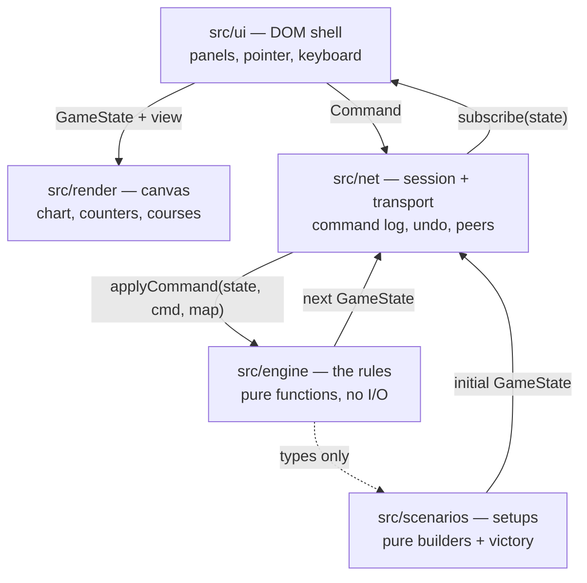

# Architecture

Triplanetary-VTT is four layers with one rule between them: **only the engine
decides anything.** Everything else draws, listens, or carries messages.



Arrows point the way data flows, and there are no arrows back into the engine
except commands. `src/engine` imports nothing from `src/ui`, `src/render`,
`src/net` or `src/scenarios`. That is not tidiness for its own sake; it is what
makes the next four sections possible.

---

## The engine is a pure function

Every rules module in `src/engine` has the same shape:

```ts
type RuleFn = (
  state: GameState,
  cmd: SomeCommand,
  map: GameMap,
) => { state: GameState; result: CommandResult };
```

`GameState` is a plain JSON value — hexes are `{q, r}`, ships and ordnance live
in records keyed by id, and nothing in it is a class, a `Map`, a `Set`, or a
closure. Rejections return the state they were given, untouched.

Three things are banned outright inside `src/engine` and `src/scenarios`, and
the lint config enforces all three:

| Banned                | Why                                                                                                   |
| --------------------- | ----------------------------------------------------------------------------------------------------- |
| `Math.random()`       | Every die goes through `rng.ts`, whose entire state is one 32-bit integer carried inside `GameState`. |
| `Date` / `Date.now()` | A rules decision that depends on the wall clock cannot be replayed.                                   |
| DOM globals           | The engine runs in a browser tab, in a Node test, and (one day) on a server, unchanged.               |

The payoff is that **the same command log always produces the same game.** From
that single property you get, for free:

- **Undo** — replay the log with the last entry removed (`GameSession.undo`).
- **Save/load** — a save file is the starting position plus the log, not a
  serialised state (`GameSession.serialise`).
- **Multiplayer** — peers exchange commands, never state; see
  [MULTIPLAYER.md](MULTIPLAYER.md).
- **Tests** — a scenario, a fixed seed, and a list of commands is a complete,
  hermetic test case.

Dice are threaded, never ambient:

```ts
const { state: rng, value } = rollDie(state.rng);
return { ...state, rng };
```

A function that forgets to thread `rng` back into the state is a bug that shows
up immediately as a repeated roll, which is why every roll site is written in
this shape.

---

## Layer by layer

### `src/engine` — the rules

| File           | Owns                                                                                                                                                                  |
| -------------- | --------------------------------------------------------------------------------------------------------------------------------------------------------------------- |
| `hex.ts`       | Axial coordinates, the six directions, distance, hexsides, pixel projection.                                                                                          |
| `geometry.ts`  | The exact course tracer: which hexes a straight vector _enters_ versus merely _touches_, whether it clips a body's printed disc, and the attacker's closest approach. |
| `mapdata.ts`   | The chart itself — bodies, radii, base sides, the generated belt.                                                                                                     |
| `map.ts`       | The indexed map: gravity, crashes, line of sight, asteroid hazards, orbit detection.                                                                                  |
| `types.ts`     | `GameState` and everything in it. A fixed contract; every other module reads it.                                                                                      |
| `commands.ts`  | The command union — the complete list of things a player can do.                                                                                                      |
| `state.ts`     | Construction and the immutable-update helpers (`withShip`, `updateShip`, `log`, …).                                                                                   |
| `rng.ts`       | Seeded dice.                                                                                                                                                          |
| `crt.ts`       | The combat results tables, transcribed from the rulebook, plus the odds ladder and the die modifiers.                                                                 |
| `ships.ts`     | Ship classes and cargo masses.                                                                                                                                        |
| `movement.ts`  | Astrogation, plotting, fuel, gravity, landing, takeoff, ramming, and the movement phase.                                                                              |
| `combat.ts`    | Gunnery, counterattack, damage, heroism, planetary defences, suppression, repair.                                                                                     |
| `ordnance.ts`  | Mines, torpedoes, nukes: launch, movement, detonation, devastation.                                                                                                   |
| `detection.ts` | Detector ranges and the "once detected, stays detected" rule.                                                                                                         |
| `logistics.ts` | Resupply, transfer, looting, capture, surrender, purchases, prospecting.                                                                                              |
| `reducer.ts`   | The one entry point: `applyCommand` routes a command to its module and runs the phase machinery.                                                                      |

Two engine decisions are worth calling out, because they look odd until you see
the reason.

**Gravity is derived, not drawn.** The map does not store a table of arrows.
`map.ts` proves that an orbit — one hex per turn between adjacent gravity hexes —
forces every arrow to point straight at its body, and generates them from that.
The derivation is in the file's header comment. Takeoff, the fall back onto a
planet, and the free choice of orbital sense then fall out of the arithmetic
instead of being special-cased.

**Per-turn intentions live in `scenarioData`.** Landing, takeoff and ramming are
declared in one phase and resolved in another, but `Ship` has no field for them
and `types.ts` is a fixed contract. They are parked in
`state.scenarioData.movement` (and `.logistics`, `._ordnance`, `._pendingAttack`)
as plain JSON, so they serialise and replay like everything else.

### `src/scenarios` — the setups

Data plus two pure functions: `build(opts)` turns a seed into a starting
`GameState`, and `checkVictory(state)` reads a state and says whether anyone has
won. Randomised setup (Nova's colony rolls, for instance) is threaded through
`GameState.rng`, so a seed reproduces a board exactly. Victory conditions that
are judgement calls in the rulebook return `null` and are quoted in the briefing
for the players to settle.

### `src/net` — session and transport

`GameSession` is the only object the shell holds. It owns the current state, the
accepted-command log, the subscriber list, and — optionally — a `Transport`.

```ts
const session = new GameSession(initialState, DEFAULT_MAP);
session.subscribe((state) => redraw(state));
const result = session.dispatch({ type: 'plotCourse', by: 'p1', ship: 's1', endpoint });
if (!result.ok) toast(result.reason);
```

A `Transport` moves commands and nothing else. `LocalTransport` is a no-op for
hot seat, `BroadcastChannelTransport` links tabs of one browser, and
`WebSocketTransport` talks to a relay with an outbound queue and reconnection
backoff.

### `src/render` — the chart

An immediate-mode canvas renderer. It reads a `GameState` and a `RenderView`
(selection, ghost course, which layers are lit) and draws; it holds no game
state and dispatches no commands. The map art is generated from `mapdata.ts` —
there is no image asset to load, which is also why the project ships no
copyrighted artwork.

### `src/ui` — the shell

Panels, pointer and keyboard bindings, and the one-way loop:

```
command → session.dispatch → subscribe → render(panels + map)
```

The shell asks the engine every legality question (`previewPlot`,
`previewAttack`, `canLaunch`, `canResupplyAt`) rather than reimplementing any of
it, and every change leaves as a `Command`. Fog of war is applied here too, by
filtering with `detection.visibleShips` — see the note in MULTIPLAYER.md about
why that is presentation-only until a server exists.

### `src/ui/ports.ts` and `src/main.ts` — the wiring

The shell is written against structural ports (`SessionPort`, `RendererPort`),
not against `GameSession` and `MapRenderer` directly. `main.ts` is the single
adapter layer where those ports meet the real objects. If a signature drifts, it
is fixed in one file rather than at thirty call sites, and the panels stay
testable against a hand-written stub.

---

## Immutability

`GameState` is frozen by convention rather than by `Object.freeze` — freezing
every state in a replay is measurable, and the convention has held. Updates go
through the helpers in `state.ts`:

```ts
const next = updateShip(state, ship.id, (s) => ({ fuel: s.fuel - 1 }));
```

Never mutate in place. The renderer, the panels and the undo log all hold
references to previous states, and a mutation makes a game's history retroactive.

---

## Testing

`npm test` runs vitest over `tests/**/*.test.ts` and `src/**/*.test.ts`. Three
kinds of test earn their keep:

1. **Geometry and tables** — the hex maths, the course tracer, and the CRT are
   transcriptions of printed rules, and are tested against the rulebook's own
   worked examples (the three-turn gravity figure on p. 3, the range-1 figure on
   p. 5).
2. **Rule scenarios** — build a scenario with a fixed seed, dispatch a list of
   commands, assert on the resulting state. Hermetic because the engine is pure.
3. **Wire behaviour** — `src/net/transport.test.ts` drives fake sockets and
   channels to check queueing, echo-dropping and reconnection without a browser.

---

## Adding to the game

- **A new rule** → the engine module that owns it, with the rulebook phrase
  quoted in a comment. If it needs a new player action, add a variant to the
  `Command` union first; the reducer, the transport's type table and the UI will
  all fail to compile until they handle it, which is the point.
- **A new scenario** → a `ScenarioDef` in `src/scenarios`. No engine changes:
  scenario-specific switches ride in `scenarioData`.
- **A new view** → a panel under `src/ui/panels`, reading `GameState` and
  emitting commands. Nothing else needs to know it exists.
