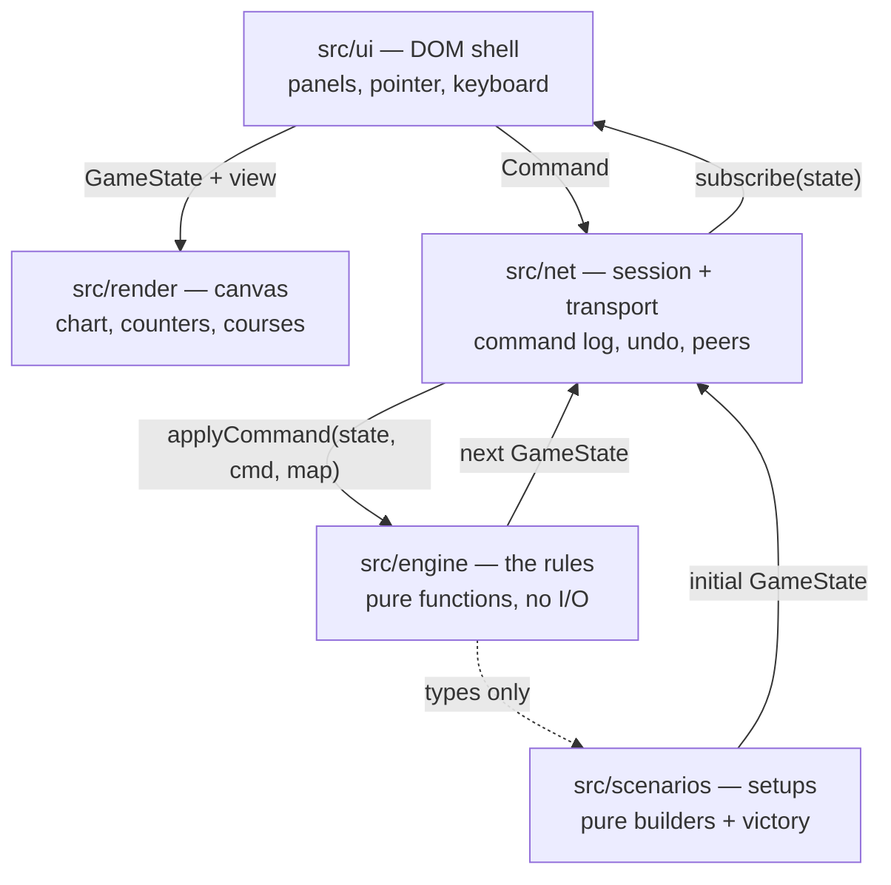

# Architecture

Triplanetary-VTT is four layers with one rule between them: **only the engine
decides anything.** Everything else draws, listens, or carries messages.



Arrows point the way data flows, and there are no arrows back into the engine
except commands. `src/engine` imports nothing from `src/ui`, `src/render`,
`src/net` or `src/scenarios`. That is not tidiness for its own sake; it is what
makes the next four sections possible.

---

## The engine is a pure function

Every rules module in `src/engine` has the same shape:

```ts
type RuleFn = (
  state: GameState,
  cmd: SomeCommand,
  map: GameMap,
) => { state: GameState; result: CommandResult };
```

`GameState` is a plain JSON value — hexes are `{q, r}`, ships and ordnance live
in records keyed by id, and nothing in it is a class, a `Map`, a `Set`, or a
closure. Rejections return the state they were given, untouched.

Three things are banned outright inside `src/engine` and `src/scenarios`, and
the lint config enforces all three:

| Banned                | Why                                                                                                   |
| --------------------- | ----------------------------------------------------------------------------------------------------- |
| `Math.random()`       | Every die goes through `rng.ts`, whose entire state is one 32-bit integer carried inside `GameState`. |
| `Date` / `Date.now()` | A rules decision that depends on the wall clock cannot be replayed.                                   |
| DOM globals           | The engine runs in a browser tab, in a Node test, and (one day) on a server, unchanged.               |

The payoff is that **the same command log always produces the same game.** From
that single property you get, for free:

- **Undo** — replay the log with the last entry removed (`GameSession.undo`).
- **Save/load** — a save file is the starting position plus the log, not a
  serialised state (`GameSession.serialise`).
- **Multiplayer** — peers exchange commands, never state; see
  [MULTIPLAYER.md](MULTIPLAYER.md).
- **Tests** — a scenario, a fixed seed, and a list of commands is a complete,
  hermetic test case.

Dice are threaded, never ambient:

```ts
const { state: rng, value } = rollDie(state.rng);
return { ...state, rng };
```

A function that forgets to thread `rng` back into the state is a bug that shows
up immediately as a repeated roll, which is why every roll site is written in
this shape.

---

## Layer by layer

### `src/engine` — the rules

| File           | Owns                                                                                                                                                                  |
| -------------- | --------------------------------------------------------------------------------------------------------------------------------------------------------------------- |
| `hex.ts`       | Axial coordinates, the six directions, distance, hexsides, pixel projection.                                                                                          |
| `geometry.ts`  | The exact course tracer: which hexes a straight vector _enters_ versus merely _touches_, whether it clips a body's printed disc, and the attacker's closest approach. |
| `mapdata.ts`   | The chart itself — bodies, radii, base sides, the generated belt.                                                                                                     |
| `map.ts`       | The indexed map: gravity, crashes, line of sight, asteroid hazards, orbit detection.                                                                                  |
| `types.ts`     | `GameState` and everything in it. A fixed contract; every other module reads it.                                                                                      |
| `commands.ts`  | The command union — the complete list of things a player can do.                                                                                                      |
| `state.ts`     | Construction and the immutable-update helpers (`withShip`, `updateShip`, `log`, …).                                                                                   |
| `rng.ts`       | Seeded dice.                                                                                                                                                          |
| `crt.ts`       | The combat results tables, transcribed from the rulebook, plus the odds ladder and the die modifiers.                                                                 |
| `ships.ts`     | Ship classes and cargo masses.                                                                                                                                        |
| `movement.ts`  | Astrogation, plotting, fuel, gravity, landing, takeoff, ramming, and the movement phase.                                                                              |
| `combat.ts`    | Gunnery, counterattack, damage, heroism, planetary defences, suppression, repair.                                                                                     |
| `ordnance.ts`  | Mines, torpedoes, nukes: launch, movement, detonation, devastation.                                                                                                   |
| `detection.ts` | Detector ranges and the "once detected, stays detected" rule.                                                                                                         |
| `logistics.ts` | Resupply, transfer, looting, capture, surrender, purchases, prospecting.                                                                                              |
| `reducer.ts`   | The one entry point: `applyCommand` routes a command to its module and runs the phase machinery.                                                                      |

Two engine decisions are worth calling out, because they look odd until you see
the reason.

**Gravity is derived, not drawn.** The map does not store a table of arrows.
`map.ts` proves that an orbit — one hex per turn between adjacent gravity hexes —
forces every arrow to point straight at its body, and generates them from that.
The derivation is in the file's header comment. Takeoff, the fall back onto a
planet, and the free choice of orbital sense then fall out of the arithmetic
instead of being special-cased.

**Per-turn intentions live in `scenarioData`.** Landing, takeoff and ramming are
declared in one phase and resolved in another, but `Ship` has no field for them
and `types.ts` is a fixed contract. They are parked in
`state.scenarioData.movement` (and `.logistics`, `._ordnance`, `._pendingAttack`)
as plain JSON, so they serialise and replay like everything else.

### `src/scenarios` — the setups

Data plus two pure functions: `build(opts)` turns a seed into a starting
`GameState`, and `checkVictory(state)` reads a state and says whether anyone has
won. Randomised setup (Nova's colony rolls, for instance) is threaded through
`GameState.rng`, so a seed reproduces a board exactly. Victory conditions that
are judgement calls in the rulebook return `null` and are quoted in the briefing
for the players to settle.

### `src/ai` — the computer opponent

Triplanetary has no solitaire rules of its own, so this is a convenience rather
than a rules module: a seat whose orders come from a function instead of a
person. That framing is the whole design.

```ts
const order = aiCommand(state, computerSeats, map); // decide
if (order) session.dispatch(order.command); // ...through the ordinary front door
```

`nextCommand(state, me, map)` returns one `Command` — the same shape a click
produces — or `null` when the seat has nothing left to do. Everything follows
from that:

- **It cannot cheat.** Every order goes through `applyCommand` and is refused on
  exactly the same terms as a player's. There is no private channel into the
  engine, and no rule it can reach around.
- **It cannot break replay.** Its orders land in the command log like any
  others, so a solo game replays from its seed and log into the identical
  position — and undo works on the computer's turns too.
- **It cannot see through walls.** With fog of war on, the driver hands the
  policy a `redactState` view: the same one the seat would get over the wire,
  with undetected ships and scenario secrets removed.
- **It is deterministic.** No `Math.random`, no `Date`; ties break on ship and
  hex order. The same position always produces the same order.

| File            | Owns                                                                                                                     |
| --------------- | ------------------------------------------------------------------------------------------------------------------------ |
| `route.ts`      | The fastest way there: an A\* search over (position, velocity), returning the first leg of an optimal course.            |
| `navigate.ts`   | Steering by eye — the greedy fallback for a goal beyond the search's horizon.                                            |
| `objectives.ts` | The briefing book. Reads each scenario's own published `scenarioData` and turns it into an errand for a particular ship. |
| `index.ts`      | The policy: owed answers first, then astrogation, combat and resupply.                                                   |
| `driver.ts`     | `aiCommand` / `stepAi` / `driveAi` — deciding one order, applying one order, and playing a whole run of them.            |

#### Routing is a search, not a rule of thumb

"A ship which is not accelerated by thrust or gravity will move as it did in the
previous turn." That sentence is why a greedy pilot is wrong: a burn made now is
felt for the rest of the game, so the course that closes the most ground _this_
turn is routinely not on the fastest route. The quick way to Venus is to spend
three turns building speed you will spend three more turns shedding, and one
turn of lookahead cannot see it.

The state space is small enough to search exactly, because a ship's future
depends on only two things, both printed on its counter:

    state = (position, velocity)

Gravity needs no third field — the pull a ship carries was picked up on the leg
it just flew, and that leg is `position - velocity` to `position`. Fuel only
counts down, so it rides along as a cost. Seven successors per node (coast, or
burn one point in one of six directions), one turn per edge, and the fastest
route is an ordinary shortest-path problem.

The heuristic is what makes it cheap enough to run for every ship every turn. A
ship at speed _s_ that must arrive at speed _e_ can fly no further in _t_ turns
than `Σ min(s+i, e+t-i)` — accelerate, coast over the peak, brake. That bound is
admissible, so the first route A\* finds is provably the fastest one; and it is
_tight_, because it prices the braking. A naive "accelerate forever" estimate
sends the search hunting through thousands of positions it will never use.

Which is why the **arrival mode** is half of every routing question rather than
a detail:

| Mode     | Means                                            | Wanted by                               |
| -------- | ------------------------------------------------ | --------------------------------------- |
| `reach`  | within _n_ hexes, down to a fighting speed       | closing on an enemy                     |
| `stop`   | in the hex, stopped                              | "landing at Ceres by simply stopping"   |
| `orbit`  | in orbit around a body — optionally one ring hex | landing; refuelling at a base           |
| `cruise` | in the hex at one hex per turn                   | "prospect by passing at a speed of 1"   |
| `match`  | same hex _and_ same vector                       | looting, capture, rescue, transfer      |
| `flyby`  | the leg entered the body's gravity               | "pass through at least one gravity hex" |

`match` also takes the target's own velocity: a disabled ship "cannot maneuver",
so where it will be is arithmetic, and the search intercepts it rather than
chasing its wake.

Two rules bound every node the search will enter, and both come off the page.
Braking sheds one hex of speed per turn and costs a point each time, so a state
carrying more speed than fuel can never stop — that is the rim, a few turns
later. And every state is played one turn further before it is accepted, because
"unless fuel is spent on the next turn, the ship would fall back to the planet
and crash": stopping one hex above Terra looks like arriving and is in fact
falling.

When a goal lies beyond the horizon the search says so rather than guessing, and
`navigate.ts` steers by eye instead.

`objectives.ts` is deliberately one-way: it reads `scenarioData`, and nothing in
`src/scenarios` knows a computer might be playing. Bi-Planetary publishes
`targets`, the Grand Tour publishes `requiredBodies` and `combatForbidden`,
Prospecting publishes `prospecting` — the AI reads the same keys the victory
checks do. A scenario that publishes nothing falls through to the general
policy, which is the right answer for the fighting scenarios, where hunting the
enemy _is_ the objective.

What it does not do: model you. It searches its own route exactly, but it plans
against the board as it stands and re-plans every turn, so it chases a
manoeuvring enemy rather than anticipating one, and it will not out-think a
thoughtful human over a long approach. What it does reliably is fly the fastest
route to wherever it is going, close on something it can actually catch, take
the fights worth taking, decline the ones that are not, and go home to refuel
before it runs dry.

### `src/net/supabase` — the online referee

The rest of `src/net` is peer-to-peer: clients echo commands at each other and
every client computes the state itself. That works for a table of friends and
fails for strangers, for three reasons the relay cannot fix — `by` is a string
anyone can type, a fogged secret cannot be kept on the machine it is hidden
from, and a deterministic generator sitting in a shared state is a client that
can see the dice before it decides whether to fire.

So online play has a participant who is not one of the players: an Edge Function
holding the Supabase service role, the only one that may write the command log,
read the seed, or see the whole board.

| File          | Owns                                                                                   |
| ------------- | -------------------------------------------------------------------------------------- |
| `protocol.ts` | The contract: one mutating call, six actions, and the shapes of both directions.       |
| `referee.ts`  | Every rules decision, and no I/O — `server/room.ts`'s idea again, for the same reason. |
| `client.ts`   | The browser side: anonymous sign-in, Realtime, catch-up, backoff.                      |

The split matters more than it looks. `referee.ts` is a set of pure functions
from a stored table and an order to the rows that ought to be written; the Edge
Function reads, calls one, and writes. That is what makes the interesting half
testable with no database anywhere near it, and it is why the rules loop has
tests while the glue has a typecheck.

**The sealed die.** The referee draws a fresh seed from `crypto.getRandomValues`
for every command, applies the command with it, records it in the log beside the
command, and seals the stored board's generator back to zero. Unpredictable
forward, exact backward: a game is still its starting position plus an ordered
list of commands, and the list simply carries its dice with it. `sealDie` in
`redact.ts` strips the generator from everything that goes over the wire.

**The database is the second lock.** `supabase/migrations/0002_policies.sql`
contains no INSERT, UPDATE or DELETE policy at all — a client takes a seat by
calling the function, not by writing the row that records it. Reads are gated on
holding a seat; a fog game's command log is not readable by anyone, because the
log plus the starting position is the board. Realtime inherits all of it, since
a row reaches a subscriber only if row level security would let them select it.

See [MULTIPLAYER.md](MULTIPLAYER.md) for the threat model and the deployment
sequence.

### `src/net` — session and transport

`GameSession` is the only object the shell holds. It owns the current state, the
accepted-command log, the subscriber list, and — optionally — a `Transport`.

```ts
const session = new GameSession(initialState, DEFAULT_MAP);
session.subscribe((state) => redraw(state));
const result = session.dispatch({ type: 'plotCourse', by: 'p1', ship: 's1', endpoint });
if (!result.ok) toast(result.reason);
```

A `Transport` moves commands and nothing else. `LocalTransport` is a no-op for
hot seat, `BroadcastChannelTransport` links tabs of one browser, and
`WebSocketTransport` talks to a relay with an outbound queue and reconnection
backoff.

### `src/render` — the chart

An immediate-mode canvas renderer. It reads a `GameState` and a `RenderView`
(selection, ghost course, which layers are lit) and draws; it holds no game
state and dispatches no commands. The map art is generated from `mapdata.ts` —
there is no image asset to load, which is also why the project ships no
copyrighted artwork.

### `src/ui` — the shell

Panels, pointer and keyboard bindings, and the one-way loop:

```
command → session.dispatch → subscribe → render(panels + map)
```

The shell asks the engine every legality question (`previewPlot`,
`previewAttack`, `canLaunch`, `canResupplyAt`) rather than reimplementing any of
it, and every change leaves as a `Command`. Fog of war is applied here too, by
filtering with `detection.visibleShips` — see the note in MULTIPLAYER.md about
why that is presentation-only until a server exists.

### `src/ui/ports.ts` and `src/main.ts` — the wiring

The shell is written against structural ports (`SessionPort`, `RendererPort`),
not against `GameSession` and `MapRenderer` directly. `main.ts` is the single
adapter layer where those ports meet the real objects. If a signature drifts, it
is fixed in one file rather than at thirty call sites, and the panels stay
testable against a hand-written stub.

---

## Immutability

`GameState` is frozen by convention rather than by `Object.freeze` — freezing
every state in a replay is measurable, and the convention has held. Updates go
through the helpers in `state.ts`:

```ts
const next = updateShip(state, ship.id, (s) => ({ fuel: s.fuel - 1 }));
```

Never mutate in place. The renderer, the panels and the undo log all hold
references to previous states, and a mutation makes a game's history retroactive.

---

## Testing

`npm test` runs vitest over `tests/**/*.test.ts` and `src/**/*.test.ts`. Three
kinds of test earn their keep:

1. **Geometry and tables** — the hex maths, the course tracer, and the CRT are
   transcriptions of printed rules, and are tested against the rulebook's own
   worked examples (the three-turn gravity figure on p. 3, the range-1 figure on
   p. 5).
2. **Rule scenarios** — build a scenario with a fixed seed, dispatch a list of
   commands, assert on the resulting state. Hermetic because the engine is pure.
3. **Wire behaviour** — `src/net/transport.test.ts` drives fake sockets and
   channels to check queueing, echo-dropping and reconnection without a browser.

---

## Adding to the game

- **A new rule** → the engine module that owns it, with the rulebook phrase
  quoted in a comment. If it needs a new player action, add a variant to the
  `Command` union first; the reducer, the transport's type table and the UI will
  all fail to compile until they handle it, which is the point.
- **A new scenario** → a `ScenarioDef` in `src/scenarios`. No engine changes:
  scenario-specific switches ride in `scenarioData`.
- **A new view** → a panel under `src/ui/panels`, reading `GameState` and
  emitting commands. Nothing else needs to know it exists.
