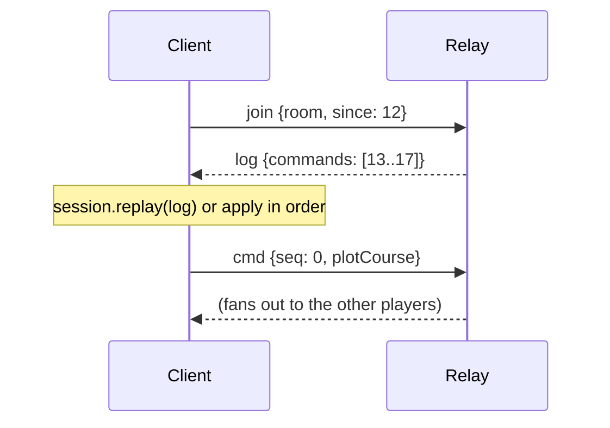
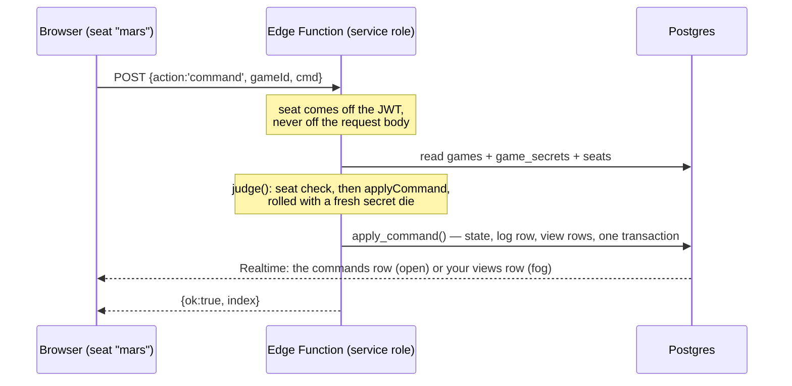

# From hot seat to networked play

> **Status.** Steps 1–4 are implemented. `server/` holds a working
> server-authoritative WebSocket server with seat authority, per-player
> redaction and reconnection; `src/net/client.ts` is the browser half. Run it
> with `npm run server`. What is _not_ done is deployment concerns —
> persistence, authentication, TLS termination — listed under
> [Checklist for a real deployment](#checklist-for-a-real-deployment).

The game already keeps everything a networked table needs. This document is the
concrete path from "two people and one keyboard" to "four people, four cities,
one relay", and it is honest about the parts that are wiring and the parts that
are still design.

---

## The one idea

**Send commands, never state.**

`applyCommand(state, cmd, map)` is a pure function, and every die roll comes out
of the mulberry32 generator whose whole state is one integer inside `GameState`.
Two clients that start from the same scenario seed and apply the same commands
in the same order compute _byte-identical_ states, including every combat
result. So the network's only job is to agree on a list:

```
scenario seed + ordered command log = the game
```

A `Command` is a few hundred bytes of JSON. A whole campaign session is a few
thousand of them — small enough to send in full on every reconnect, which is why
catch-up, undo, save/load and spectating are all the same mechanism.

---

## The four steps

### 1. Hot seat — shipping today

```ts
const session = new GameSession(scenario.build({ seed }), DEFAULT_MAP);
```

No transport at all. Players pass the keyboard; the shell shows the active
player's view. `undo()` works because the log can be rewound with nobody else to
disagree.

### 2. One browser, several tabs

```ts
import { BroadcastChannelTransport, GameSession } from '@net/index.js';

const transport = new BroadcastChannelTransport({ channel: `tri:${gameId}` });
const session = new GameSession(scenario.build({ seed }), DEFAULT_MAP, transport);
```

Every tab holds the whole log and computes the whole state; a tab is a player's
screen. This is the cheapest way to exercise the fan-out path — it uses exactly
the same code path as the network case — and it is genuinely playable on one
machine with several monitors.

Both tabs must start from the same seed. Pass it in the URL
(`?scenario=escape&seed=12345`).

### 3. A relay server

```ts
import { GameSession, WebSocketTransport } from '@net/index.js';

const transport = new WebSocketTransport('wss://relay.example/ws', { room: gameId });
const session = new GameSession(scenario.build({ seed }), DEFAULT_MAP, transport);

// Adopt the server's ordering after a reconnect rather than the local guess.
transport.onLog((log) => session.replay(log));
transport.onStatus((s) => showConnectionBadge(s));
```

The client applies its own commands immediately (the game feels local), sends
them on, and applies what arrives from the others. If the socket drops, outgoing
commands queue; on reconnect the join frame says how much of the log this client
already holds and the relay sends back the rest.

### 4. Server-authoritative — shipping today

The relay from step 3 does not know the rules, so it cannot tell a legal plot
from a modified client's fantasy. Making it authoritative is a small change,
because the server runs _the same engine_:

```ts
import { applyCommand } from './engine/reducer.js';

// Per room: keep the state alongside the log.
const next = applyCommand(room.state, frame.cmd, DEFAULT_MAP);
if (!next.result.ok) {
  send(socket, { t: 'reject', v: 1, seq: frame.seq, reason: next.result.reason });
  return; // never reaches the log, never reaches the other players
}
room.state = next.state;
room.log.push(frame.cmd);
```

Plus one check the engine cannot make, because it is about people rather than
ships: **the seat check.** A connection is authenticated as a player id, and any
frame whose `cmd.by` is not that id is dropped before it reaches `applyCommand`.
Without it, a client can pass another player's turn or plot another player's
ships — the engine happily validates such a command, because as far as the rules
are concerned it is the right player acting.

---

## Wire protocol

Version `1`. Frames are JSON objects with a `t` tag and a `v` version; anything
else is dropped rather than guessed at. Defined in `src/net/transport.ts`.

| Frame  | Direction      | Fields                  | Meaning                                                    |
| ------ | -------------- | ----------------------- | ---------------------------------------------------------- |
| `join` | client → relay | `from`, `room`, `since` | I am joining this table and already hold `since` commands. |
| `cmd`  | both ways      | `from`, `seq`, `cmd`    | One command, applied locally by the sender already.        |
| `log`  | relay → client | `commands`              | Catch-up: the slice of the log the client is missing.      |

`from` is a per-connection id used only to drop one's own echo. It is **not** a
player id and carries no authority: a real deployment authenticates the
connection and derives the seat from that, never from a field the client sets.

---

## A minimal relay server

Sixty lines of Node and one dependency (`npm i ws`). It keeps a log per room and
fans out; it does not know the rules. Save as `server/relay.mjs` and run
`node server/relay.mjs 8787`.

```js
import { WebSocketServer } from 'ws';

const PROTOCOL_VERSION = 1;
const port = Number(process.argv[2] ?? 8787);

/** room name -> { log: Command[], peers: Set<WebSocket> } */
const rooms = new Map();

const roomOf = (name) => {
  let room = rooms.get(name);
  if (!room) {
    room = { log: [], peers: new Set() };
    rooms.set(name, room);
  }
  return room;
};

const send = (socket, frame) => {
  if (socket.readyState === 1) socket.send(JSON.stringify(frame));
};

const wss = new WebSocketServer({ port });
console.log(`Triplanetary relay on ws://localhost:${port}`);

wss.on('connection', (socket) => {
  let room = null;

  socket.on('message', (data) => {
    let frame;
    try {
      frame = JSON.parse(String(data));
    } catch {
      return; // junk: ignore rather than disconnect
    }
    if (!frame || frame.v !== PROTOCOL_VERSION) return;

    if (frame.t === 'join') {
      room?.peers.delete(socket);
      room = roomOf(String(frame.room ?? 'default'));
      room.peers.add(socket);
      // Catch-up: everything this client has not seen, in log order.
      const since = Number.isInteger(frame.since) ? Math.max(0, frame.since) : 0;
      if (since < room.log.length) {
        send(socket, {
          t: 'log',
          v: PROTOCOL_VERSION,
          commands: room.log.slice(since),
        });
      }
      return;
    }

    if (frame.t === 'cmd' && room) {
      if (typeof frame.cmd?.type !== 'string' || typeof frame.cmd?.by !== 'string')
        return;
      // ── Authoritative validation goes here (see step 4): check the seat,
      //    run applyCommand against room.state, and drop the frame if it fails.
      room.log.push(frame.cmd);
      for (const peer of room.peers) if (peer !== socket) send(peer, frame);
    }
  });

  socket.on('close', () => {
    room?.peers.delete(socket);
    if (room && room.peers.size === 0 && room.log.length === 0) rooms.delete(room);
  });
});
```

What it deliberately does not do: authentication, persistence, room lifetimes,
rate limiting, or TLS. Put it behind a reverse proxy, keep the log in Postgres or
on disk if games should outlive a restart, and add the seat check before letting
strangers in.

---

## Reconnection



The socket dropping is not a crisis: the client keeps playing against its local
state, queues what it sends, and on reconnect asks for the tail. Two levels of
strictness are available:

- **Tail catch-up** (default). The client applies the missed commands in the
  order the relay sends them. Fast, and correct as long as its own queued
  commands did not interleave with the ones it missed.
- **Full resync**. Construct the transport with `fullCatchUp: true` and wire
  `transport.onLog((log) => session.replay(log))`. The client throws away its
  local ordering and recomputes the game from the scenario start using the
  relay's log — the authoritative order. This is the correct choice when the
  server validates commands, and it is also the rollback primitive for
  optimistic local application.

Both work because replay is exact. `GameSession.replay` re-runs from the
scenario's initial state, and the seeded RNG makes every die come up the same
way it did the first time.

---

## Fog of war needs a server

`GameOptions.fogOfWar` filters the _display_: `detection.visibleShips` hides
enemy ships the current player has not detected, and the renderer skips them.
That is enough for hot seat, where the players agree not to peek, and it is
faithful to how the rules ask you to behave at a physical table:

> "For this scenario to work, the Patrol and Merchant players must be willing to
> ignore undetected pirate ships until they are legally detected."

It is **not** security. Every client holds the full `GameState`, because every
client computes it from the full command log. Open the devtools and the pirates
are right there. Several scenarios turn on hidden information and are therefore
only as honest as the players:

| Scenario               | Hidden information                                                   |
| ---------------------- | -------------------------------------------------------------------- |
| Escape                 | Which of the three transports carries the fugitives.                 |
| Lateral 7              | Nine pirate dummy counters and four Navy ones, inverted in the belt. |
| Piracy / campaign      | Pirate ships that have not entered detection range.                  |
| Fleet Mutiny (variant) | Which ships rebelled.                                                |

Making it real requires the server to be the only holder of the full state and
to **filter what it sends per player**:

1. The server owns `state` and the log, and runs `applyCommand` (step 4).
2. For each connected player it computes the visible subset —
   `detection.detectionField`, `detection.isDetected`, plus the scenario's own
   secrets — and sends only the commands and results that touch what that player
   can legally see. A `plotCourse` for an undetected pirate becomes nothing at
   all; the same ship becoming detected sends its position and course.
3. Clients then hold a _view_, not the authoritative state, so they can no longer
   recompute everything from the log. They need periodic authoritative snapshots
   of what they can see, and the client-side prediction has to be able to be
   corrected — which is exactly what `GameSession.replay` does for ordering, and
   what a `setState`-style hook would have to do for filtered snapshots.

That is the real cost of fog of war: it trades away the property that makes
everything else in this codebase simple, namely that every peer can derive the
whole game from the log. It is worth doing for public games with strangers; it is
not worth doing for a table of friends, which is why the current build ships the
honest-players version and says so.

Two details the filter must get right, both from p. 8:

- "Once a ship has been detected by the enemy, it remains detected (regardless of
  range) until it arrives at a friendly base" — visibility is _sticky state_ on
  the ship (`Ship.detectedBy`), not a range test recomputed each frame.
- "Ships which reach Clandestine drop off the detectors of the opposing side" —
  and the special asteroids around it are impassable without scanners, so a
  filtered view must not leak the base's location through a rejected move.

---

---

## Playing over Supabase

The WebSocket relay in `server/` is the trusted-table model: it authenticates
nobody, it holds the whole game in memory, and it hands every client the
generator that decides the dice. That is a fine thing to run for four friends on
a LAN and the wrong thing to open to strangers.

The Supabase path is the one for strangers. Same engine, same redaction, same
"a game is its starting position plus an ordered list of commands" — but the
list lives in Postgres, the only participant that may write it is an Edge
Function holding the service role, and the database itself enforces what each
seat may read.

```
supabase/migrations/0001_schema.sql    the tables a game lives in
supabase/migrations/0002_policies.sql  who may read what, and nobody may write
supabase/migrations/0003_apply.sql     accepting an order, atomically
supabase/migrations/0004_throttle.sql  a cost for guessing join codes
supabase/migrations/0005_kinds.sql     two games at one table, and a password
supabase/migrations/0006_configure.sql  changing a lobby's setup
supabase/migrations/0007_children.sql   a child table for the frozen sky
supabase/functions/game/index.ts       the referee on the wire
src/net/supabase/protocol.ts           the contract between the two
src/net/supabase/referee.ts            the rules loop, with no I/O in it
src/net/kinds.ts                       what the referee asks of a game's rules
src/net/ogreRules.ts                   the ground game, answering it
src/net/supabase/client.ts             the browser side
```

### The shape of it



Two things are worth saying plainly about that picture.

**The client never writes.** There is not one INSERT, UPDATE or DELETE policy in
`0002_policies.sql`. A player takes a seat by _calling the function_, not by
writing the row that records it, which is what makes `cmd.by` mean something: a
relay takes the field on trust, and here the referee reads the seat off the JWT
and ignores what the frame claims.

**The database is the second lock.** If the function had a bug that leaked a
game id, row level security would still refuse the read: `games`, `seats`,
`commands` and `views` are all gated on holding a seat at that table, and
`game_secrets` — the seed and the whole board — has no client grant at all.

### The sealed die

`GameState.rng` is a single 32-bit integer, and every roll in the game comes out
of it. So a client holding the state can roll the next die _before_ deciding
whether to fire. Fog of war does not help in the slightest: the number is inside
the fogged state.

Online, therefore, the referee never rolls with the state's own generator.

1. A command arrives.
2. The referee draws a fresh seed from `crypto.getRandomValues`.
3. It applies the command with that seed, and records the seed in the log row
   beside the command.
4. It seals the stored board's generator back to zero.

Which buys both halves at once. **Unpredictable forward:** the seed for the next
command does not exist until the command arrives, and comes from the operating
system rather than from anything a client holds. **Exact backward:** the log
carries the dice it was rolled with, so replaying it reproduces the game roll for
roll. A game is still its starting position plus an ordered list of commands;
the list simply carries its dice with it.

`sealDie` in `src/net/redact.ts` is what strips the generator on the way out, and
it applies to every game, fogged or not. Note that the relay in `server/` does
_not_ do this, and cannot: its clients replay commands themselves, so they need
the generator. That is the trusted-table trade, stated rather than hidden.

### What each seat may read

| table           | who may SELECT                                        |
| --------------- | ----------------------------------------------------- |
| `games`         | anyone holding a seat at that table                   |
| `seats`         | anyone holding a seat at that table                   |
| `commands`      | seats at that table, **and only if it is not fogged** |
| `views`         | your own row, and no other seat's                     |
| `game_secrets`  | nobody — no grant, and an explicit refusal on top     |
| `join_attempts` | nobody; the referee's own bookkeeping                 |

A fog game does not stream its command log at all, to anybody, because the log
plus the starting position reconstructs the whole board — undetected ships
included, which is exactly what the fog is for. Its seats read `views` instead:
one redacted board per seat, rewritten in place on every command, and readable
only by the seat it belongs to.

Realtime respects all of this for free, because a row reaches a subscriber only
if row level security would let that subscriber select it. The policies _are_
the streaming rules.

### Two games, one referee

The referee never names an engine. Everything it needs from a game is the
`KindRules` interface in `src/net/kinds.ts` — build a board from a seed and
setup, apply one command with a die, seal the generator, redact for a seat,
plan the computer's orders, and summarise (turn, finished, fog, seats) — and a
table's `games.kind` says which rules to fetch. `tri` is Triplanetary; `ogre`
is the ground game, answered by `src/net/ogreRules.ts`, whose actor is whoever
the board says is deciding: the seat deploying, the seat firing in an overrun,
or the active player. The browser client fetches the same rules once the
referee has said which table it joined, and the Ogre engine is loaded on
demand so a fleet table never pays for it.

Two things follow. The ground game is open information, so its log streams to
every seat the way an unfogged fleet game's does, and every browser rebuilds
the board by replay — the referee's sealed die included. And the computer's
seats are the referee's to play: `playComputerSeats` asks the ported AI for a
plan and runs it through the same judge a person's orders go through, order
by order, until the decision is a human's again.

### A password instead of an account

Nobody at these tables has a login. What a player has is a six-letter code
and the password the host read out with it, and that pair is the whole gate
for a refereed table now, as it always was for a quick one. The referee hashes
the password (salted SHA-256, `v1$salt$digest`, via Web Crypto) into
`game_secrets.password`, which no client may read; a wrong password is
answered as "no table on that code" and charged as a throttle miss, so the
code and the password are one guess rather than two. A table opened with no
password — every table from before 0005 — still opens on its code alone.

The password is also how a seat survives a lost browser. A seat belongs to the
anonymous account that took it, and that account lives in one browser's
storage: clear it, or come back on a phone, and the seat reads as somebody
else's. `reclaim_seat` takes it back — the password proves the caller belongs
at the table, the seat's name says which chair is theirs, and the previous
holder is dropped, any other seat the claimant held being vacated in the same
transaction. Only a locked table offers it, and never for a computer's seat.
A quick table has no names to prove, since everyone at it knows the one
password; its answer is the clock — a seat nobody has been heard from in a
while is open again, and sitting there is the reclaim.

### Building a battle, and changing one from the lobby

The ground game's `custom` scenario builds from an `OrderOfBattle` — the
shape a campaign hands a battle — so a table designed in the battle builder
travels the wire as a campaign transfer does: `CreateRequest.order` is stored
with the seed, every joiner rebuilds the same board from it, and the referee
needs nothing new. The order names the map (the stock cratered or green
board, or one generated from a seed and a size), both forces in the engine's
own vocabulary, and the terms (command post, breakthrough or attrition; a
turn limit; the cratered map's forward ceiling). `scenarioData.order` is the
only copy of those terms, which is what lets a board name its own map:
`mapOf(def, state)` reads it, and nothing else in the engine cares where a
map came from.

A host may change all of that until the table begins. `configure` takes the
same choices `create` did and `reconfigure_game` rewrites the scenario, the
secrets and the roster in one transaction, lobby only, host only. The roster
is rebuilt from the new board's seats: whoever held a seat keeps the one at
the same ordinal, a player whose seat went to the computer is stood up, and a
host whose seat did is moved to the first open one — or the change is refused
if there is none. The referee also sends every table a `title` and a `brief`
(the map, the forces, the terms) so a lobby can describe a setup it has no
engine to read.

### Both games at a quick table

The quick table carries both games too, and for the same reason the referee
does: nothing in `quick.ts` knows either rulebook. A row names its `kind`, the
client asks `KindRules` to build the opening position and to apply each move
with the die Postgres drew, and the ground game's engine is fetched only by a
browser that sits down at a ground table. The fingerprint that catches drift
covers both boards — where every ship is with what left in it, or where every
counter is with how much of it is still working.

What a quick table cannot do is play a seat. The computer's seat is the
referee's, so a ground table with one is refereed-only and the host dialog
says why; two people at a quick table play each other.

`schema.sql` is written to be re-pasted, and this change is why that matters:
an install from before both games were carried gains `tri_tables.kind` with an
`alter table ... add column if not exists`, and every table it already had
keeps working as the fleet game. `tri_host` gained two arguments, so the old
signature is dropped before the new one is created — two functions of that
name and PostgREST could not tell a call for one from a call for the other.

### The frozen sky at a quick table

There is no referee to open the ground battle's table and announce it, so
every browser at the war works out the same code instead: `codeFor(parentCode,
battleId)`, which is FNV-1a over the two things everybody already has, mapped
into the schema's own alphabet. `tri_host` takes that code (`p_code`), opens
the table under it if it is free, and raises `code-taken` if it is not — which
is the answer the second browser wanted, because it means the table is
standing and it should join. The battle inherits the war's password, so
everyone let into the war is let into its battle.

Carrying the verdict home is the browser's job here rather than the server's.
A decided board is read for its `BattleResult`, the war is rejoined, and the
result is posted into its move list as `resolveGroundBattle` — which any
seated player may give, so both try and the second finds the war no longer
waiting and stands down.

### The frozen sky, online: child tables

Orbital Drop freezes the sky when landers are down and hands the ground
battle to Ogre. At a refereed table the referee does the handing: after any
command that leaves a fleet board waiting on a ground battle (`KindRules.
handoff`), it builds the assault from the order, opens a **child table** for
it through `create_child_game` — same password, same host, the roster drawn
from the parent's by name, so the powers' players keep their seats and a
base's militia is the computer's — and links the two: the parent carries the
child's code, the child the parent's. Every browser at the parent sees the
link and hops across (the seat follows the account, the password follows the
client); the war table is left listening-off, never vacated. The child begins
at once, with the computer's opening moves.

When the child ends, `KindRules.settle` reads its `BattleResult` off the
board and `settleParent` turns it into the parent's own `resolveGroundBattle`
order, judged and committed like any other, with the parent's computer seats
answering in the same move; `unlink_child` then clears the link. Leaving the
finished battle takes a browser back to the war. A quick table has no
referee to do any of this, and says so when its sky freezes.

### The attacks it is built against

Assume a player with a genuine account, a genuine seat, the client source in
front of them, and `curl`. In rough order of how much they would gain:

- **Read the seed.** Every fog scenario derives its hidden setup from it —
  Escape picks the fugitive with `rollDie({seed})`, Lateral 7 places its dummies
  from the same draw — so the seed _is_ the secret. It lives in `game_secrets`,
  which has no client grant, and `create` ignores a client-supplied seed for any
  fogged table so the host cannot choose one they already know.
- **Read another seat's board.** `views` is keyed by seat and the policy compares
  against the caller's own. A vacated seat has its row deleted, so an empty chair
  is not a fogged board waiting to be sat in, and changing seats once the game
  has started is refused outright.
- **Read a fog game's log.** Not readable, by policy, by anyone at the table.
- **Forge `cmd.by`.** Checked against the seat the JWT holds, before the rules
  see the command.
- **Write the log directly.** No grant, no policy — and append-only triggers
  that bind the service role too, because the one participant able to rewrite
  history is the one holding the service key.
- **Guess a join code.** Uniform refusals give nothing away, but a hit announces
  itself, so misses are budgeted per account: twenty in ten minutes, then the
  answer is the same refusal either way. A wrong password is a miss on the same
  budget, and the same refusal.
- **Take a seat with the code alone.** A locked table's join checks the password
  before it looks at the seats, and a reclaim is a join, so nobody at the table
  can be unseated by anyone who is not already let in.
- **Predict the dice.** See the sealed die above.

### What is deliberately _not_ defended

- **Two browsers, one human.** Nothing stops somebody opening a second
  anonymous account and taking a second seat at their own table. The roster
  shows it, and that is the whole answer: this is a game between people who
  chose to sit down together, not a ranked ladder.
- **Other players' account ids.** A seat row carries the opaque `user_id` of
  whoever holds it, visible to the two people you sat down with. Hiding it needs
  a column grant, and a role without SELECT on every column cannot issue
  `select *`, which is what Realtime's row authorisation appears to do. Breaking
  the roster stream to hide a uuid from somebody already looking at your ships is
  the wrong trade.
- **A friend with the password taking your seat.** Anyone let in can reclaim
  any human seat by name. Among people who chose to sit down together that is
  the feature — it is how you get your own seat back — and the roster shows who
  did it.
- **Denial of service beyond the throttle.** Supabase's own limits do the rest.

### Testing it without a Supabase project

Both halves are testable with nothing running:

- `tests/supabase-referee.test.ts` drives the rules loop directly. It is the
  `server/room.ts` trick again — keep the decisions in pure functions and the
  I/O somewhere else — and it proves the sealed die, seat authority, exact
  replay, per-seat fog, and the computer's seats. `tests/supabase-ogre.test.ts`
  does the same for a ground table: the deploying seat is the actor, the
  computer plays through deployment, a replay rebuilds the board, and a
  password hashes, verifies and reclaims.
- `tests/supabase-schema.test.ts` boots **real PostgreSQL** in WebAssembly
  (PGlite), runs the migration files read off disk, and then attacks them. Every
  denial in the table above is its own case, named for its attack, and the suite
  was mutation-tested: ten deliberate holes were opened in the policies and each
  one was caught.

A third check covers the function itself, and it exists because the obvious one
is not enough. `npm run typecheck` reads `supabase/functions` with tsc and two
shims, but tsc resolves `./x.js` to `./x.ts` and reads a declaration file
sitting beside a bundle, and Deno does neither — so a function tsc likes can
still be one Deno refuses. `npm run functions:typecheck` runs `deno check`, with
the resolver that will actually see the code.

Making that pass took a fix worth recording. The bundle's sibling `engine.d.ts`
was invisible to Deno, which consults a declaration only when a `@deno-types`
comment points at one; without it every type import from the bundle failed and
cascaded into implicit-any across both files. The comment is now there. And the
declaration re-exports the original sources by `.js` specifier, which is why the
check runs with `--sloppy-imports` — those sources exist in the repository and
not in the upload, which is precisely why this belongs in CI rather than at
deploy time.

What none of it can prove is what Supabase itself does — Realtime's exact row
authorisation query, PostgREST's schema exposure, and whether `config.toml`'s
keys are the ones the platform reads. Those need a project. Two smaller things
also wait on one: nothing yet schedules `reap_stale_lobbies()`, and the schema
tests run on PostgreSQL 18 while `config.toml` pins major version 17.

---

## What is actually implemented — the WebSocket relay

```
server/room.ts        the authoritative rules loop, with no networking in it
server/index.ts       a WebSocket + HTTP shell around it
src/net/protocol.ts   the wire protocol, and inbound frame validation
src/net/redact.ts     what one player is allowed to know
src/net/client.ts     the browser client, with optimistic apply and backoff
```

Run a server:

```bash
npm run server                                  # bi-planetary on :8787
PORT=9000 SCENARIO=lateral-7 SEED=42 npm run server
curl localhost:8787/health                      # rooms, turns, seat occupancy
```

Connect a client to `ws://host:port/?room=<id>&clientId=<stable-id>` and send a
`hello` naming the seat you want.

### The two publication modes

`Room.usesSnapshots` decides how the server tells clients what happened, and it
is simply `state.options.fogOfWar`:

|              | open information                                            | fog of war                                                                   |
| ------------ | ----------------------------------------------------------- | ---------------------------------------------------------------------------- |
| server sends | the accepted **command**                                    | a per-client redacted **snapshot**                                           |
| client does  | replays it locally                                          | adopts it wholesale                                                          |
| frame size   | tiny                                                        | whole state                                                                  |
| why          | determinism guarantees every client lands on the same state | replaying the command would need the hidden state the fog exists to withhold |

Adopting a snapshot sets `GameSession.isServerAuthoritative`, which turns off
undo and local replay: the client's log no longer describes how the game got
where it is.

### Two things a relay cannot do

**`by` is just a string.** Nothing in a relay stops a client sending
`{type: 'endPhase', by: 'someone-else'}`. `Room.accept` checks the seat against
the claimed author _before_ the rules see the command, and the engine then has
the last word — being correctly seated does not make an illegal move legal.

**Secrets have to be withheld at the source.** Hiding a counter in the renderer
is not hiding it. `redactState` drops undetected enemy ships, enemy ordnance
outside the detector net, and scenario secrets, and it does so on the server so
the data never reaches the client at all.

### How scenario secrets are classified

Three rules, in order, applied to each `scenarioData` entry:

1. **`secret`** — the declared hiding place, sent only to the player it names.
   Ownership is derived from the ships it references, so Escape's
   `{fugitiveShip: <a Pilgrim transport>}` reaches the Pilgrim and nobody else.
2. **Tables keyed by ship or player** are split, and each player receives only
   their own rows. Lateral 7's `dummyAssignments` maps every real ship to the
   dummies concealing it, for _both_ sides; shipping it whole would tell each
   player which of the enemy's counters are real.
3. **Anything naming only other players' ships** is withheld as a backstop.

Rules 2 and 3 exist because rule 1 was not enough, and the failure was
instructive. Escape originally shipped its decoy list in plain `scenarioData`.
It named two of the three transports — so the Enforcer, who was correctly
denied the `secret`, could name the fugitive by elimination anyway. A partial
leak was worse than no secret at all. `tests/multiplayer.test.ts` now asserts
the general property: **no wire payload ever names a ship the viewer cannot
see**, across every fog-of-war scenario.

Scenarios that need a ship visible regardless of detection declare
`alwaysVisible: {playerId: [shipId, ...]}` — Lateral 7 uses it for
"the pirate knows the location of the liner". Each player is sent only their own
row, so the declaration itself reveals nothing.

## Ordering, undo and conflicts

**Ordering.** The relay's log order is the game's order. Clients apply their own
commands optimistically for responsiveness; where that guess is wrong the
correction is a replay, not a patch.

**Turn structure does most of the work.** Triplanetary is strictly sequential —
one player-turn at a time, five phases, and the reducer rejects commands from
anyone but the active player. Genuine concurrent edits are therefore rare: the
only commands a non-phasing player issues are counterattacks and surrender
responses, both of which the engine expects to arrive while a specific decision
is pending. This is a much easier problem than a real-time game.

**Undo is local-only.** `GameSession.canUndo` is false whenever a non-local
transport is attached: rewinding one client's log while the others keep theirs
would desynchronise the table. A networked table that wants take-backs needs an
explicit protocol — a `rollback` frame that every client honours by replaying a
truncated log — and a social rule about who may ask for one. The primitives are
there (`replay`); the agreement is not, so the button is disabled rather than
being quietly wrong.

**Rejections are signals.** `GameSession.refused` keeps the last few commands the
engine turned down, tagged `local`, `remote` or `replay`. A `remote` rejection
means the two clients no longer agree about the state — surface it, do not
swallow it, and resync with a full catch-up.

---

## Checklist for a real deployment

This was written before the Supabase path existed, as a list of what a relay
would still owe you. Every line of it is now done, and where it is done is worth
recording — a checklist nobody ever ticks is just a list of regrets.

- [x] **Authenticate connections and bind each to a seat; drop frames whose
      `cmd.by` does not match.** The Edge Function reads the account off the JWT
      and `judge()` checks it against `cmd.by` before the rules see the command.
- [x] **Run `applyCommand` server-side; never trust a client's legality check.**
      `src/net/supabase/referee.ts`, and the client does not even apply
      optimistically — it waits for the referee's answer, because it cannot know
      the die.
- [x] **Persist `{ scenarioId, seed, log }` per room.** `game_secrets` and
      `commands`. The log carries its dice too, so it replays exactly.
- [x] **Rate-limit.** `0004_throttle.sql` budgets join-code guesses per account;
      commands are already gated on holding a seat.
- [x] **Version the protocol on the wire and refuse mismatches loudly.**
      `SUPABASE_PROTOCOL_VERSION`, checked in `parsePlayRequest`.
- [x] **Decide about fog of war before opening to strangers.** Decided: the
      referee redacts per seat, fog games do not stream their log at all, and
      the generator is sealed in every game. The relay in `server/` remains the
      trusted-table model, and says so.

One thing the original list did not think to ask for, and should have:

- [x] **Take the dice away from the clients.** A deterministic generator in a
      shared state is a client that can see the future. See the sealed die.
