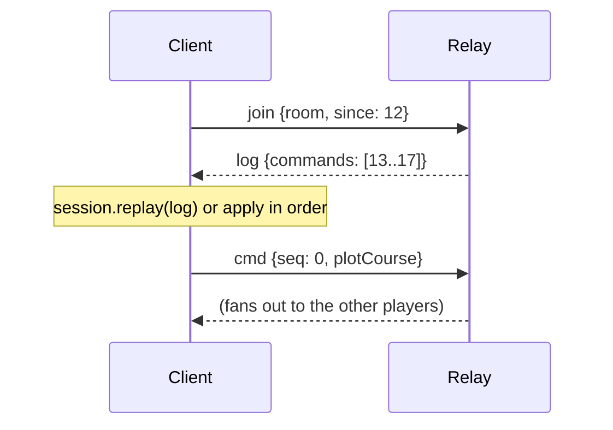

# From hot seat to networked play

> **Status.** Steps 1–4 are implemented. `server/` holds a working
> server-authoritative WebSocket server with seat authority, per-player
> redaction and reconnection; `src/net/client.ts` is the browser half. Run it
> with `npm run server`. What is _not_ done is deployment concerns —
> persistence, authentication, TLS termination — listed under
> [Checklist for a real deployment](#checklist-for-a-real-deployment).

The game already keeps everything a networked table needs. This document is the
concrete path from "two people and one keyboard" to "four people, four cities,
one relay", and it is honest about the parts that are wiring and the parts that
are still design.

---

## The one idea

**Send commands, never state.**

`applyCommand(state, cmd, map)` is a pure function, and every die roll comes out
of the mulberry32 generator whose whole state is one integer inside `GameState`.
Two clients that start from the same scenario seed and apply the same commands
in the same order compute _byte-identical_ states, including every combat
result. So the network's only job is to agree on a list:

```
scenario seed + ordered command log = the game
```

A `Command` is a few hundred bytes of JSON. A whole campaign session is a few
thousand of them — small enough to send in full on every reconnect, which is why
catch-up, undo, save/load and spectating are all the same mechanism.

---

## The four steps

### 1. Hot seat — shipping today

```ts
const session = new GameSession(scenario.build({ seed }), DEFAULT_MAP);
```

No transport at all. Players pass the keyboard; the shell shows the active
player's view. `undo()` works because the log can be rewound with nobody else to
disagree.

### 2. One browser, several tabs

```ts
import { BroadcastChannelTransport, GameSession } from '@net/index.js';

const transport = new BroadcastChannelTransport({ channel: `tri:${gameId}` });
const session = new GameSession(scenario.build({ seed }), DEFAULT_MAP, transport);
```

Every tab holds the whole log and computes the whole state; a tab is a player's
screen. This is the cheapest way to exercise the fan-out path — it uses exactly
the same code path as the network case — and it is genuinely playable on one
machine with several monitors.

Both tabs must start from the same seed. Pass it in the URL
(`?scenario=escape&seed=12345`).

### 3. A relay server

```ts
import { GameSession, WebSocketTransport } from '@net/index.js';

const transport = new WebSocketTransport('wss://relay.example/ws', { room: gameId });
const session = new GameSession(scenario.build({ seed }), DEFAULT_MAP, transport);

// Adopt the server's ordering after a reconnect rather than the local guess.
transport.onLog((log) => session.replay(log));
transport.onStatus((s) => showConnectionBadge(s));
```

The client applies its own commands immediately (the game feels local), sends
them on, and applies what arrives from the others. If the socket drops, outgoing
commands queue; on reconnect the join frame says how much of the log this client
already holds and the relay sends back the rest.

### 4. Server-authoritative — shipping today

The relay from step 3 does not know the rules, so it cannot tell a legal plot
from a modified client's fantasy. Making it authoritative is a small change,
because the server runs _the same engine_:

```ts
import { applyCommand } from './engine/reducer.js';

// Per room: keep the state alongside the log.
const next = applyCommand(room.state, frame.cmd, DEFAULT_MAP);
if (!next.result.ok) {
  send(socket, { t: 'reject', v: 1, seq: frame.seq, reason: next.result.reason });
  return; // never reaches the log, never reaches the other players
}
room.state = next.state;
room.log.push(frame.cmd);
```

Plus one check the engine cannot make, because it is about people rather than
ships: **the seat check.** A connection is authenticated as a player id, and any
frame whose `cmd.by` is not that id is dropped before it reaches `applyCommand`.
Without it, a client can pass another player's turn or plot another player's
ships — the engine happily validates such a command, because as far as the rules
are concerned it is the right player acting.

---

## Wire protocol

Version `1`. Frames are JSON objects with a `t` tag and a `v` version; anything
else is dropped rather than guessed at. Defined in `src/net/transport.ts`.

| Frame  | Direction      | Fields                  | Meaning                                                    |
| ------ | -------------- | ----------------------- | ---------------------------------------------------------- |
| `join` | client → relay | `from`, `room`, `since` | I am joining this table and already hold `since` commands. |
| `cmd`  | both ways      | `from`, `seq`, `cmd`    | One command, applied locally by the sender already.        |
| `log`  | relay → client | `commands`              | Catch-up: the slice of the log the client is missing.      |

`from` is a per-connection id used only to drop one's own echo. It is **not** a
player id and carries no authority: a real deployment authenticates the
connection and derives the seat from that, never from a field the client sets.

---

## A minimal relay server

Sixty lines of Node and one dependency (`npm i ws`). It keeps a log per room and
fans out; it does not know the rules. Save as `server/relay.mjs` and run
`node server/relay.mjs 8787`.

```js
import { WebSocketServer } from 'ws';

const PROTOCOL_VERSION = 1;
const port = Number(process.argv[2] ?? 8787);

/** room name -> { log: Command[], peers: Set<WebSocket> } */
const rooms = new Map();

const roomOf = (name) => {
  let room = rooms.get(name);
  if (!room) {
    room = { log: [], peers: new Set() };
    rooms.set(name, room);
  }
  return room;
};

const send = (socket, frame) => {
  if (socket.readyState === 1) socket.send(JSON.stringify(frame));
};

const wss = new WebSocketServer({ port });
console.log(`Triplanetary relay on ws://localhost:${port}`);

wss.on('connection', (socket) => {
  let room = null;

  socket.on('message', (data) => {
    let frame;
    try {
      frame = JSON.parse(String(data));
    } catch {
      return; // junk: ignore rather than disconnect
    }
    if (!frame || frame.v !== PROTOCOL_VERSION) return;

    if (frame.t === 'join') {
      room?.peers.delete(socket);
      room = roomOf(String(frame.room ?? 'default'));
      room.peers.add(socket);
      // Catch-up: everything this client has not seen, in log order.
      const since = Number.isInteger(frame.since) ? Math.max(0, frame.since) : 0;
      if (since < room.log.length) {
        send(socket, {
          t: 'log',
          v: PROTOCOL_VERSION,
          commands: room.log.slice(since),
        });
      }
      return;
    }

    if (frame.t === 'cmd' && room) {
      if (typeof frame.cmd?.type !== 'string' || typeof frame.cmd?.by !== 'string')
        return;
      // ── Authoritative validation goes here (see step 4): check the seat,
      //    run applyCommand against room.state, and drop the frame if it fails.
      room.log.push(frame.cmd);
      for (const peer of room.peers) if (peer !== socket) send(peer, frame);
    }
  });

  socket.on('close', () => {
    room?.peers.delete(socket);
    if (room && room.peers.size === 0 && room.log.length === 0) rooms.delete(room);
  });
});
```

What it deliberately does not do: authentication, persistence, room lifetimes,
rate limiting, or TLS. Put it behind a reverse proxy, keep the log in Postgres or
on disk if games should outlive a restart, and add the seat check before letting
strangers in.

---

## Reconnection



The socket dropping is not a crisis: the client keeps playing against its local
state, queues what it sends, and on reconnect asks for the tail. Two levels of
strictness are available:

- **Tail catch-up** (default). The client applies the missed commands in the
  order the relay sends them. Fast, and correct as long as its own queued
  commands did not interleave with the ones it missed.
- **Full resync**. Construct the transport with `fullCatchUp: true` and wire
  `transport.onLog((log) => session.replay(log))`. The client throws away its
  local ordering and recomputes the game from the scenario start using the
  relay's log — the authoritative order. This is the correct choice when the
  server validates commands, and it is also the rollback primitive for
  optimistic local application.

Both work because replay is exact. `GameSession.replay` re-runs from the
scenario's initial state, and the seeded RNG makes every die come up the same
way it did the first time.

---

## Fog of war needs a server

`GameOptions.fogOfWar` filters the _display_: `detection.visibleShips` hides
enemy ships the current player has not detected, and the renderer skips them.
That is enough for hot seat, where the players agree not to peek, and it is
faithful to how the rules ask you to behave at a physical table:

> "For this scenario to work, the Patrol and Merchant players must be willing to
> ignore undetected pirate ships until they are legally detected."

It is **not** security. Every client holds the full `GameState`, because every
client computes it from the full command log. Open the devtools and the pirates
are right there. Several scenarios turn on hidden information and are therefore
only as honest as the players:

| Scenario               | Hidden information                                                   |
| ---------------------- | -------------------------------------------------------------------- |
| Escape                 | Which of the three transports carries the fugitives.                 |
| Lateral 7              | Nine pirate dummy counters and four Navy ones, inverted in the belt. |
| Piracy / campaign      | Pirate ships that have not entered detection range.                  |
| Fleet Mutiny (variant) | Which ships rebelled.                                                |

Making it real requires the server to be the only holder of the full state and
to **filter what it sends per player**:

1. The server owns `state` and the log, and runs `applyCommand` (step 4).
2. For each connected player it computes the visible subset —
   `detection.detectionField`, `detection.isDetected`, plus the scenario's own
   secrets — and sends only the commands and results that touch what that player
   can legally see. A `plotCourse` for an undetected pirate becomes nothing at
   all; the same ship becoming detected sends its position and course.
3. Clients then hold a _view_, not the authoritative state, so they can no longer
   recompute everything from the log. They need periodic authoritative snapshots
   of what they can see, and the client-side prediction has to be able to be
   corrected — which is exactly what `GameSession.replay` does for ordering, and
   what a `setState`-style hook would have to do for filtered snapshots.

That is the real cost of fog of war: it trades away the property that makes
everything else in this codebase simple, namely that every peer can derive the
whole game from the log. It is worth doing for public games with strangers; it is
not worth doing for a table of friends, which is why the current build ships the
honest-players version and says so.

Two details the filter must get right, both from p. 8:

- "Once a ship has been detected by the enemy, it remains detected (regardless of
  range) until it arrives at a friendly base" — visibility is _sticky state_ on
  the ship (`Ship.detectedBy`), not a range test recomputed each frame.
- "Ships which reach Clandestine drop off the detectors of the opposing side" —
  and the special asteroids around it are impassable without scanners, so a
  filtered view must not leak the base's location through a rejected move.

---

---

## What is actually implemented

```
server/room.ts        the authoritative rules loop, with no networking in it
server/index.ts       a WebSocket + HTTP shell around it
src/net/protocol.ts   the wire protocol, and inbound frame validation
src/net/redact.ts     what one player is allowed to know
src/net/client.ts     the browser client, with optimistic apply and backoff
```

Run a server:

```bash
npm run server                                  # bi-planetary on :8787
PORT=9000 SCENARIO=lateral-7 SEED=42 npm run server
curl localhost:8787/health                      # rooms, turns, seat occupancy
```

Connect a client to `ws://host:port/?room=<id>&clientId=<stable-id>` and send a
`hello` naming the seat you want.

### The two publication modes

`Room.usesSnapshots` decides how the server tells clients what happened, and it
is simply `state.options.fogOfWar`:

|              | open information                                            | fog of war                                                                   |
| ------------ | ----------------------------------------------------------- | ---------------------------------------------------------------------------- |
| server sends | the accepted **command**                                    | a per-client redacted **snapshot**                                           |
| client does  | replays it locally                                          | adopts it wholesale                                                          |
| frame size   | tiny                                                        | whole state                                                                  |
| why          | determinism guarantees every client lands on the same state | replaying the command would need the hidden state the fog exists to withhold |

Adopting a snapshot sets `GameSession.isServerAuthoritative`, which turns off
undo and local replay: the client's log no longer describes how the game got
where it is.

### Two things a relay cannot do

**`by` is just a string.** Nothing in a relay stops a client sending
`{type: 'endPhase', by: 'someone-else'}`. `Room.accept` checks the seat against
the claimed author _before_ the rules see the command, and the engine then has
the last word — being correctly seated does not make an illegal move legal.

**Secrets have to be withheld at the source.** Hiding a counter in the renderer
is not hiding it. `redactState` drops undetected enemy ships, enemy ordnance
outside the detector net, and scenario secrets, and it does so on the server so
the data never reaches the client at all.

### How scenario secrets are classified

Three rules, in order, applied to each `scenarioData` entry:

1. **`secret`** — the declared hiding place, sent only to the player it names.
   Ownership is derived from the ships it references, so Escape's
   `{fugitiveShip: <a Pilgrim transport>}` reaches the Pilgrim and nobody else.
2. **Tables keyed by ship or player** are split, and each player receives only
   their own rows. Lateral 7's `dummyAssignments` maps every real ship to the
   dummies concealing it, for _both_ sides; shipping it whole would tell each
   player which of the enemy's counters are real.
3. **Anything naming only other players' ships** is withheld as a backstop.

Rules 2 and 3 exist because rule 1 was not enough, and the failure was
instructive. Escape originally shipped its decoy list in plain `scenarioData`.
It named two of the three transports — so the Enforcer, who was correctly
denied the `secret`, could name the fugitive by elimination anyway. A partial
leak was worse than no secret at all. `tests/multiplayer.test.ts` now asserts
the general property: **no wire payload ever names a ship the viewer cannot
see**, across every fog-of-war scenario.

Scenarios that need a ship visible regardless of detection declare
`alwaysVisible: {playerId: [shipId, ...]}` — Lateral 7 uses it for
"the pirate knows the location of the liner". Each player is sent only their own
row, so the declaration itself reveals nothing.

## Ordering, undo and conflicts

**Ordering.** The relay's log order is the game's order. Clients apply their own
commands optimistically for responsiveness; where that guess is wrong the
correction is a replay, not a patch.

**Turn structure does most of the work.** Triplanetary is strictly sequential —
one player-turn at a time, five phases, and the reducer rejects commands from
anyone but the active player. Genuine concurrent edits are therefore rare: the
only commands a non-phasing player issues are counterattacks and surrender
responses, both of which the engine expects to arrive while a specific decision
is pending. This is a much easier problem than a real-time game.

**Undo is local-only.** `GameSession.canUndo` is false whenever a non-local
transport is attached: rewinding one client's log while the others keep theirs
would desynchronise the table. A networked table that wants take-backs needs an
explicit protocol — a `rollback` frame that every client honours by replaying a
truncated log — and a social rule about who may ask for one. The primitives are
there (`replay`); the agreement is not, so the button is disabled rather than
being quietly wrong.

**Rejections are signals.** `GameSession.refused` keeps the last few commands the
engine turned down, tagged `local`, `remote` or `replay`. A `remote` rejection
means the two clients no longer agree about the state — surface it, do not
swallow it, and resync with a full catch-up.

---

## Checklist for a real deployment

- [ ] Authenticate connections and bind each to a seat; drop frames whose
      `cmd.by` does not match.
- [ ] Run `applyCommand` server-side; never trust a client's legality check.
- [ ] Persist `{ scenarioId, seed, log }` per room — that is the whole game, and
      it is small.
- [ ] Rate-limit commands per connection.
- [ ] Version the protocol on the wire (`v`) and refuse mismatches loudly.
- [ ] Decide about fog of war before opening to strangers; the honest-players
      model is a legitimate choice, but say which one you are running.
