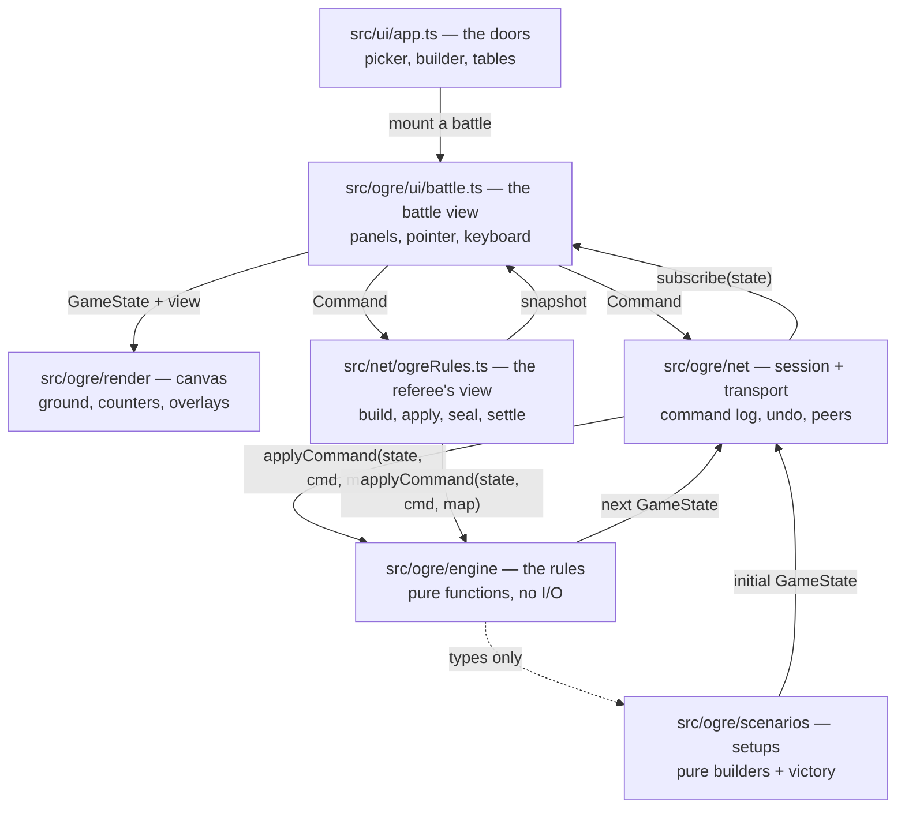

# Ogre architecture

The ground game lives under `src/ogre`. It is four layers with one rule between
them: **only the engine decides anything.** Everything else draws, listens, or
carries messages.



Arrows point the way data flows, and there are no arrows back into the engine
except commands. `src/ogre/engine` imports nothing from `src/ogre/ui`,
`src/ogre/render`, `src/ogre/net` or `src/ogre/scenarios`, and nothing at all
from the Triplanetary side of the repository.

---

## The engine is a pure function

`GameState` is a plain JSON value — hexes are `{q, r}`, units live in a record
keyed by id, and nothing in it is a class, a `Map`, a `Set`, or a closure.
Rejections return the state they were given, untouched.

Three things are banned outright inside `src/ogre/engine`,
`src/ogre/scenarios` and `src/ogre/campaign`, and `.eslintrc.cjs` enforces all
three:

| Banned                | Why                                                                                                   |
| --------------------- | ----------------------------------------------------------------------------------------------------- |
| `Math.random()`       | Every die goes through `rng.ts`, whose entire state is one 32-bit integer carried inside `GameState`. |
| `Date` / `Date.now()` | A rules decision that depends on the wall clock cannot be replayed.                                   |
| DOM globals           | The engine runs in a browser tab, in a Node test, and on the referee, unchanged.                      |

The payoff is that **the same command log always produces the same game.** From
that one property you get, for free: undo (replay the log without its last
entry), save/load (a save file is the starting position plus the log),
multiplayer (peers exchange commands, never state), and hermetic tests.

Dice are threaded, never ambient:

```ts
const { state: rng, value } = rollDie(state.rng);
return { ...state, rng };
```

A function that forgets to thread `rng` back into the state is a bug that shows
up immediately as a repeated roll, which is why every roll site is written in
this shape.

---

## Layer by layer

### `src/ogre/engine` — the rules

| File          | Owns                                                                                                                                                              |
| ------------- | ----------------------------------------------------------------------------------------------------------------------------------------------------------------- |
| `hex.ts`      | Flat-top axial coordinates, distance (which _is_ range in Ogre — there is no line of sight), hexsides, and the map's printed `1401` labels.                       |
| `terrain.ts`  | The five terrain tables of 5.08, organised by running gear, plus the combat effects of 7.14.                                                                      |
| `map.ts`      | The indexed board. Roads are links across hexsides, not flags on hexes, because that is what "moving along the line of the road" means.                           |
| `mapdata.ts`  | The generators. Two boards, from a seed.                                                                                                                          |
| `units.ts`    | Every counter's statistics, and where each number came from.                                                                                                      |
| `ogres.ts`    | Ogre components, the tread track, and the Size Table.                                                                                                             |
| `crt.ts`      | The combat results table and the odds ladder. No state, no dice.                                                                                                  |
| `rng.ts`      | Mulberry32, and nothing else. One 32-bit integer is the whole generator.                                                                                          |
| `types.ts`    | `GameState` and everything in it. A fixed contract.                                                                                                               |
| `commands.ts` | The command union — the complete list of things a player can do.                                                                                                  |
| `state.ts`    | Construction and the immutable-update helpers.                                                                                                                    |
| `mobility.ts` | Which terrain table a unit reads. One line of indirection in its own file, because `movement.ts` and `state.ts` both need it and neither should import the other. |
| `movement.ts` | Paths, the road bonus, stacking, hazards, recovery, mounting.                                                                                                     |
| `combat.ts`   | Gunnery, spillover, the two Ogre-specific targeting rules.                                                                                                        |
| `los.ts`      | Line of sight, which exists for exactly one weapon in the game: 7.02 says there are no limitations, and 12.02–12.03 say the laser is the exception.               |
| `missiles.ts` | Cruise missiles (Section 10): the launch that is the crawler's attack, the flight lasers may intercept, and the crater.                                           |
| `ram.ts`      | Section 6 in full, in both directions.                                                                                                                            |
| `overrun.ts`  | Section 8: the point-blank sub-turn, with its own initiative and its own arithmetic.                                                                              |
| `setup.ts`    | Deployment: the window before turn 1 in which each side rearranges its own counters inside its printed area, subject to the scenario's ceilings.                  |
| `reserves.ts` | Off-map reserves (Orbital Drop §3.03) — who is held back, from which turn they may enter, and along which edge.                                                   |
| `reducer.ts`  | The one entry point: `applyCommand` routes and runs the phase machinery.                                                                                          |
| `index.ts`    | The barrel. Everything outside the engine imports from here, so the modules inside can be rearranged without touching a shell.                                    |

Four engine decisions are worth calling out.

**Movement is a path problem, not a hex problem.** The road bonus is a property
of the whole phase ("stays on the road for the entire movement phase"), and a
stream may only be crossed by a unit that began the phase beside it. Neither can
be judged one step at a time, so `planPath` accepts or rejects a whole path.

**An Ogre is never a target.** `TargetRef` has separate variants for a weapon
and for the treads, and `previewAttack` refuses a bare `{kind: 'unit'}` aimed at
an Ogre with a message saying so. The treads variant does not touch the odds
ladder at all.

**An overrun is a sub-turn inside the movement phase.** `GameState.overrun`
suspends movement, and while it is set the player entitled to act is the side
_firing_, not the side whose turn it is — the defender goes first (8.04). It is
the only place in Ogre where that happens, and `applyCommand` special-cases it
rather than letting every module wonder whose turn it is.

**Terrain damage lives in the state, not the map.** `GameMap` is immutable
scenery that can be shared between games; craters, rubble and cut roads go in
`GameState.terrainOverrides` and `routesCut`, so a game replays exactly.

### `src/ogre/scenarios` — the setups

Data plus two pure functions: `build(opts)` turns a seed into a starting
`GameState`, and `checkVictory(state)` reads a state and says whether anyone has
won. Deployment is randomised through a seeded generator, so a seed reproduces a
board exactly and a different seed is a different battle plan — which is what
the rulebook means by "This is an example ... NOT the only legal setup!"

A scenario may also name the board a particular game of it is played on, through
the optional `mapFor(state)`. That exists for the custom battle, whose map is
generated from the order of battle carried in `scenarioData` rather than being
fixed at module load. Read the board through `mapOf(def, state)`, never `def.map`
directly.

### `src/ogre/net` — session and transport

`GameSession` is the object a shell holds. It owns the current state, the
accepted-command log, the subscriber list, and — optionally — a `Transport`.

```ts
const session = new GameSession(scenario.build({ seed }), mapOf(scenario, opening), {
  victoryCheck: scenario.checkVictory,
});
session.subscribe(() => redraw(session.state));
const result = session.dispatch({ type: 'ram', by: 'ogre', unit: 'mk3', target });
if (!result.ok) toast(result.reason);
```

A `Transport` moves commands and nothing else. `LocalTransport` is a no-op for
hot seat; `BroadcastChannelTransport` links tabs of one browser.

Undo is local-only, and deliberately so: rewinding one client's log while the
others keep theirs would desynchronise the table. The primitive is here
(`replay`); the social protocol that would make it safe over a network is not,
so `canUndo` is false rather than being quietly wrong.

`adoptSnapshot` is the other door in. A board that came from a referee — judged,
with the die rolled where nobody could see it — replaces the current state
whole, and the session marks itself `isServerAuthoritative`: the local log no
longer describes how the board got here, so undo and replay switch off. The
session becomes a view onto somebody else's authority, which is exactly what the
online battle needs and nothing more.

### `src/ogre/render` — the board

An immediate-mode canvas renderer. It reads a `GameState` and a `RenderView`
(selection, reachable hexes, ram targets, queued attackers) and draws; it holds
no game state and dispatches no commands. Per-hex variation comes from
`hexNoise` in `theme.ts`, a _hash_ of the coordinates, never from the game's
generator — the renderer must not consume dice, and the same hex must look the
same on every client. Nothing is loaded: the cratered plain, the counters and
the Ogre's damage bar are all drawn from the same data the rules use, which is
also why this project ships no copyrighted artwork.

### `src/ogre/ui/battle.ts` — the battle view

The whole of the game's own interface, with the application chrome pruned away —
no scenario picker, no address-bar doors — leaving the part that _is_ the game:
panels, pointer and keyboard bindings, and the one-way loop:

```
command → session.dispatch → subscribe → render(panels + map)
```

`createOgreBattle` mounts into a host element the shell provides, owns its
listeners for exactly as long as it is mounted, and `destroy()` gives them back.
The view decides nothing. Every legality question — `reachable`, `previewAttack`,
`canRam`, `canOverrun`, `legalSetupHexes`, `launchCheck` — is asked of the
engine rather than reimplemented, and every change leaves as a `Command`. The
one place it exercises judgement is presentation: a Mark V has twenty-six
weapons, and the fire panel groups them by kind with a count, because "both
secondaries on the GEV" is how a player thinks and twenty-six checkboxes is not.

Two things about the seam are worth stating plainly, because they are what make
the same view serve four different ways of playing.

**What to fight arrives as an `OgreBattleSource`.** Either a `scenario` — an id
and a seed, optionally with an `OrderOfBattle` for a custom battle — or an
`order`, a campaign battle that carries its ending with it. A campaign battle
must put its result somewhere, so the source supplies both a way home
(`onResult`) and a `resultToken` for the case where the war room is running in
someone else's browser. A printed scenario ends with the verdict and the door.

**A refereed table is an optional `OnlineBattle`.** When it is present the board
is the referee's: every snapshot it publishes is adopted, and every order the
view forms is `send`-ed to the referee instead of dispatched locally. The local
engine still answers every _question_ — where a unit may go, what a shot is
worth — because the referee runs the same engine and the answer is the same.
That is the whole of the online adaptation; nothing else in the view changes.

A seat may be the computer's. When the decision belongs to an AI seat the view
asks `aiPlan` for its orders and dispatches them one at a time, so a human
watching sees the moves land rather than a jump cut. Every accepted order is
reported out through `onProgress`, which is how the shell autosaves a battle.

### `src/ui/app.ts` — the doors

The Triplanetary shell owns the application: it decides when an Ogre battle
exists and where it mounts. Everything it does with the ground game goes through
dynamic `import()`, so **a player who never reaches a ground battle never
downloads the Ogre engine** — the same treatment the Supabase client gets.

- `openOgreScenarios` imports `src/ogre/scenarios/index.js`, builds each
  scenario once at seed 1 to read its seat names off `playerOrder`, and opens
  the picker. Starting one calls `openOgreScenario`, which imports
  `src/ogre/ui/battle.js` and mounts it over the overlay layer.
- The builder's catalogue is assembled by `loadCatalogue` from
  `src/ogre/scenarios/index.js`, `engine/units.js`, `engine/ogres.js`,
  `engine/map.js` and `engine/hex.js`, and cached — the engine does not change
  between openings. `openCustomBuilder` turns what the player assembles into an
  `OrderOfBattle`, which is then fought exactly like a printed scenario, or
  hosted.
- `openGroundBattle` is the campaign door: a landing fought for a war room in
  this browser, mounted with `reportLabel` set so its result can walk straight
  back into the campaign.
- `mountOgreTable` is the online door. It hands the view the referee's board and
  the seat this browser holds; the scenario is built locally only to name the
  map and the victory check. The board itself is never this browser's.
- An unfinished battle is autosaved under `triplanetary-ogre-battle-v1` as what
  built it plus its command log — the same replayable shape the campaign uses —
  and `resumeBattle` reopens it.

Only one ground battle is mounted at a time (`groundBattle`), and
`closeGroundBattle` destroys it.

### `src/net/ogreRules.ts` — the referee's view

The online table does not know about either engine. It speaks to a `KindRules`
(`src/net/kinds.ts`), and `ogreRules()` is the ground game's implementation:
`build` a starting board from a scenario id and a setup, `apply` an order with a
die the referee chose, `seal` the generator out of a board before anyone sees
it, `redact` (nothing — Ogre has no hidden information, so every seat sees the
whole board), `computerOrders` for AI seats, `settle` a finished battle into a
`BattleResult`, and `summary` for the lobby.

Ogre is the easier of the two games to referee, and the reason is a property of
the engine: strictly one player acts at a time, and the reducer already refuses
anybody else. The referee only needs to know _who_ that is, which is
`actorOf`:

```ts
export const actorOf = (state: OgreState): PlayerId =>
  setupActor(state) ?? overrunActor(state) ?? activePlayer(state);
```

Those are exactly the two places where the acting player is not the phasing
player — deployment, which goes side by side, and an overrun, where the defender
fires first. Both were engine decisions long before there was a referee, and the
referee gets them for free.

The Ogre rules deliberately live in their own module rather than in `kinds.ts`,
because `kinds.ts` is imported by everything: putting them there would pull the
whole ground engine into the first bundle a player downloads. For the same
reason `kinds.ts` carries `GROUND_SCENARIO_IDS` as a written-out list rather
than reading the scenario table, and `tests/supabase-ogre.test.ts` checks that
list against the real one so a scenario added and forgotten fails a test rather
than a hand-off.

### `src/campaign/orders.ts` and `src/ogre/campaign/result.ts` — the boundary

`OrderOfBattle` and `BattleResult` in `src/campaign/orders.ts` are the
vocabulary the war speaks: forces, terms, and what came back. They belong to
neither engine. `src/ogre/campaign/result.ts` reads a finished `GameState` into
that vocabulary — a projection, not a judgement, because the one judgement (who
won, at what level) was the scenario's and is passed through untouched. It
counts `surviving` rather than `onBoard`, deliberately: a unit that escaped off
a map edge is out of the battle but not out of the war, and several Ogre
scenarios turn on exactly that difference. `src/campaign/codec.ts` is how an
order or a result travels as a pasteable token when the two ends are in
different browsers.

---

## Immutability

`GameState` is frozen by convention rather than by `Object.freeze` — freezing
every state in a replay is measurable, and the convention has held. Updates go
through the helpers in `state.ts`:

```ts
const next = updateOgre(state, ogre.id, (o) => ({ treads: o.treads - 4 }));
```

Never mutate in place. The renderer, the panels and the undo log all hold
references to previous states, and a mutation makes a game's history
retroactive.

---

## Testing

`npm test` runs vitest; the ground game's tests are `tests/ogre/**/*.test.ts`.
Three kinds of test earn their keep:

1. **Tables and geometry** — the CRT, the odds ladder and the hex maths are
   transcriptions, and are tested against the rulebook's own worked examples.
2. **Rule scenarios** — put three counters on a bare board, fix the die by
   searching for a seed that produces it, dispatch a command, assert on the
   result. Hermetic because the engine is pure.
3. **Provenance** — `tests/ogre/stats.test.ts` asserts that values the rules
   text pins down are right _and_ that values it does not are still flagged, so
   `docs/RULES-MAPPING.md` cannot go stale.

---

## Adding to the game

- **A new rule** → the engine module that owns it, with the rulebook phrase
  quoted in a comment. If it needs a new player action, add a variant to the
  `Command` union first; the reducer and the battle view will fail to compile
  until they handle it, which is the point.
- **A new scenario** → a `ScenarioDef` in `src/ogre/scenarios`, added to
  `SCENARIOS`. No engine changes: scenario-specific state rides in
  `scenarioData`. If it should be playable online, add its id to
  `GROUND_SCENARIO_IDS` in `src/net/kinds.ts` as well — the test will tell you
  if you forget.
- **A new view** → a panel in `src/ogre/ui/battle.ts`, reading `GameState` and
  emitting commands. Nothing else needs to know it exists.
