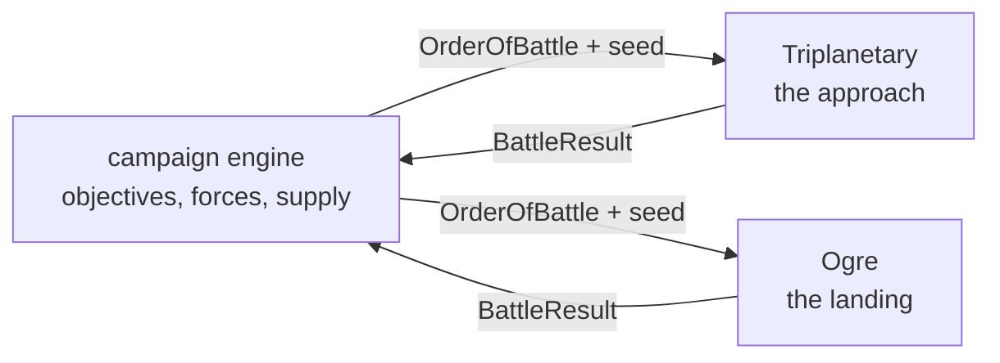

# Linking Ogre and Triplanetary

> **Status.** Implemented, and both halves now live here. This document was
> written first as a design ("it exists so that the two engines stay shaped for
> it while they are being built"), in the standalone
> [OGRE-VTT](https://github.com/onlinemph/OGRE-VTT) repository, and the
> campaign was then built in the shape it drew. The design sections below are
> kept as written, because they explain why the seams sit where they do — and
> the seams are still there, holding the ground game at `src/ogre/` to the
> campaign at `src/campaign/`. For how a campaign turn is _played_, see
> [ORBITAL-DROP.md](ORBITAL-DROP.md).

Two games, one war. Triplanetary decides who gets to the ground; Ogre decides
what happens when they land.

---

## Why the two fit

They were built to the same contract, which is most of the work:

|           | Triplanetary                          | Ogre                     |
| --------- | ------------------------------------- | ------------------------ |
| Engine    | `applyCommand(state, cmd, map)`, pure | the same                 |
| Dice      | mulberry32, state inside `GameState`  | the same                 |
| A game is | scenario seed + command log           | the same                 |
| Scenario  | `build(opts)` + `checkVictory(state)` | the same                 |
| Hexes     | pointy-top, axial `{q, r}`            | flat-top, axial `{q, r}` |

The hex orientation differs because the two games' printed maps differ — a star
chart is pointy-top, a wargame map with `1401` column-row numbering is flat-top
— and that is a rendering concern, not a shared-state one. Nothing about a
campaign needs the two boards to agree.

---

## The shape of a campaign

A campaign is a third pure engine that owns neither battle. It holds a map of
objectives, a pool of forces, and a log of its own; a battle is something it
_launches_ and then reads a result from.



Two boundary types carry everything across, and they are deliberately small:

```ts
/** What the campaign hands a battle. */
interface OrderOfBattle {
  readonly battleId: string;
  readonly seed: number;
  readonly scenarioId: string;
  readonly sides: readonly {
    readonly player: string;
    readonly faction: string;
    /** Engine-specific unit ids with counts: 'HVY' x4, or 'destroyer' x2. */
    readonly forces: Readonly<Record<string, number>>;
  }[];
  /** Free-form terms the scenario understands (entry edges, turn limits). */
  readonly terms: Readonly<Record<string, unknown>>;
}

/** What a battle hands back. */
interface BattleResult {
  readonly battleId: string;
  readonly winners: readonly string[];
  readonly level: 'complete' | 'standard' | 'marginal';
  /** Per side: what walked away, in the same vocabulary as `forces`. */
  readonly survivors: Readonly<Record<string, Readonly<Record<string, number>>>>;
  readonly victoryPoints: Readonly<Record<string, number>>;
  /** The whole battle, for replay: its seed and its command log. */
  readonly replay: { readonly seed: number; readonly log: readonly unknown[] };
}
```

They have grown exactly one field since: `BattleResult.ogres`, the surviving
cybertanks' record sheets, because Orbital Drop §7 carries damage from one
battle into the next and there was nowhere else to put it.

These live in `src/campaign/orders.ts` — in both repositories, duplicated
rather than shared, because a package the two both depend on would couple
their release cycles over forty lines of types. The codec beside them
(`src/campaign/codec.ts`) turns orders and results into pasteable tokens, and
the codec tests on each side pin the wire format — the two copies _are_ the
compatibility contract. Here that test is `tests/campaign-boundary.test.ts`.
The conventions the types cannot state: `sides[0]` is the attacker and moves
first, and `forces` speaks each engine's own vocabulary — `ShipClass` keys
plus `freight` for cargo lots for the fleet game; `UnitClassId`/`OgreTypeId`
keys with infantry in squads for the ground game.

---

## The fiction that makes it work

Ogre's setting is a 21st-century Earth of the Combine and the Paneuropean
Federation. Triplanetary's is the inner Solar System. The join is the obvious
one and it is already in Ogre's own preface: the war is fought over resources,
and the resources are not all on Earth. Terra is deliberately not an objective
— the ground war there is the stalemate both sides are trying to break.

A campaign turn:

1. **Strategic.** Both sides spend production on fleets and ground forces, and
   either may commit to one offensive.
2. **Space.** Contested transfers are fought in Triplanetary. Who arrives, and
   with how much cargo, is the output. Routine logistics between friendly
   ports is below the campaign's resolution — only contested transfers are
   fought.
3. **Ground.** A side that achieves orbit lands. What it lands _with_ is the
   surviving cargo from step 2, converted into an Ogre order of battle.
4. **Consolidation.** Ground results change who holds what, which changes
   production, which changes step 1.

The conversion in step 3 is the only genuinely new rule, and it is one table:
**one cargo lot — ten tons of hold — lands one armour unit of ground force.**
Ogre already prices everything in armour units (1.07) and Triplanetary already
prices holds in tons, so the table is the exchange rate and nothing else.
Infantry pack three squads to the lot, the way 3.02 packs three squads to the
counter. The table is the campaign's to own — it is `src/campaign/convert.ts`,
beside the campaign engine, and neither game engine knows it exists.

---

## The ground half

- **The Landing** (`src/ogre/scenarios/landing.ts`) — the scenario a campaign
  ground battle builds: a hot landing on the green map, the invader down on
  the western strip against a dug-in garrison and its command dome, forces on
  both sides arriving in the `OrderOfBattle`. Playable from the scenario list
  with a printed default, which is also what makes it independently useful —
  a scenario that builds from a force list is exactly what a point-buy screen
  needs.
- **The boundary** (`src/campaign/orders.ts`, `src/campaign/codec.ts`) — the
  types and the token codec, shared by both games because both cross the same
  seam. The Ogre side of the projection is
  `src/ogre/campaign/result.ts`: `readBattleResult`, pure, from a finished
  `GameState` (plus the command log) to a `BattleResult`. The fleet side is
  `src/campaign/result.ts`.
- **The door** — a `?battle=<token>` URL starts the battle the token encodes,
  and because this app plays both games it accepts either game's scenarios;
  the war room's "Open in the Ogre app" link is that URL pointed at the
  standalone app. When the battle ends, the victory screen offers the result
  as a token to paste back into the war room. A token naming a scenario the
  app does not play gets a sentence saying so rather than a half-built battle.

The standalone OGRE-VTT app is still the game's own home, and the door above
stays the way to fight a landing on a machine that only has it. But the ground
engine, renderer, scenarios and AI are all here too, under `src/ogre/`, with
the shell pruned to a mountable battle view behind an **Ogre** door on the
start menu — so a campaign is playable end to end on one page, and so is an
Ogre attack for its own sake.

### The boundary, as the referee now uses it

The design assumed the two types would travel as tokens between two apps, and
they still can. Online, they travel further in and never leave the process:
`KindRules` in `src/net/kinds.ts` — the one interface the referee, the client
and the Edge Function speak to instead of an engine — declares
`handoff(state): OrderOfBattle | null`, `settle(state): BattleResult | null`
and `settleCommand(state, result)`. The Triplanetary rules answer `handoff`
from `dropData(s).pendingGround` when an Orbital Drop board is waiting on a
landing; the Ogre rules in `src/net/ogreRules.ts` answer `settle` by calling
the same `readBattleResult`; and the referee opens a child table for the
battle and feeds the result back to the parent as a command. Same two types,
same conventions, no token — the token path is now the offline case rather
than the only case.

---

## Decisions, revisited

The "decisions worth making now" from the original design, and how they held:

**Keep `scenarioData` free-form.** Held, and it is what makes the whole thing
work twice over: the order of battle rides in it, so victory checks and result
readers need nothing but the state — and so does the _referee_, which recovers
the order from the stored board when an online sync rebuilds a campaign
battle's opening position.

**Keep victory a value, not a callback into the shell.** Held. The campaign
reads `BattleResult`s; it never observes a battle.

**Keep the command log serialisable and complete.** Held — and extended: every
battle report the campaign accepts holds the result, and every result holds
its `{seed, log}`, so a campaign save can replay any engagement in the war.

**Do not share a package yet.** Still holding, and the duplication now runs the
other way round. The boundary types and the codec are duplicated file-for-file
between the two repositories rather than extracted, and the campaign engine
itself was moved whole out of OGRE-VTT and into this one — possible precisely
because nothing shared bound it there. It sits beside the online play now,
which is where its battles get fought.

---

## Hidden information in the ground game

Ogre in its basic form has none, which is why there is no fog-of-war machinery
on the ground side and no redaction layer. Both players see the whole board,
and that is the game as printed.

That is a claim the code makes, not just a remark. In `src/net/ogreRules.ts`
the rules answer

```ts
redact: (state) => state,
```

— identity — and their `summary` reports `fog: false`, so a ground table is
never opened as a fog table: the referee writes no per-seat views for it
(`viewsForAll` in `src/net/supabase/referee.ts` is only reached when
`game.fog`), and every client holds the whole command log and recomputes the
whole state. Compare `src/net/redact.ts`, which is the fleet game's four
hundred lines of the opposite. This document is the standing note that the
identity is a fact about the rules implemented, not about Ogre.

Three optional rules do introduce hidden information, and each would need the
server to hold the secret rather than the client:

| Rule              | What is hidden                                          |
| ----------------- | ------------------------------------------------------- |
| 13.04 Mines       | Which hexes are mined, until something drives over one. |
| 13.05 Camouflage  | What each `?` counter actually is.                      |
| 13.06 Dummy units | Which counters are nothing at all.                      |

None of them are implemented yet. When they are, the honest implementation is
the same one every hidden-information game needs: the server owns the state and
filters what it sends per player, and clients hold a _view_ rather than
something they can recompute from the log. That trades away the property that
makes everything else here simple, so it is worth doing for public games with
strangers and not worth doing for a table of friends. Note what it costs
concretely: `redact` stops being identity, `summary` starts reporting
`fog: true` for those games, and a ground client moves off the replay path onto
the snapshot path — the same three changes, in the same three places, that the
fleet game already made.

### The seat check the ground game needs

One thing about the ground game is worth knowing before anybody writes a seat
check for it, because a naive one gets it wrong: **an overrun hands initiative
to the other player.** "The defender has the first fire round" (8.04), and the
rounds then alternate until one side is gone. While `GameState.overrun` is set,
the player entitled to act is `overrunActor(state)`
(`src/ogre/engine/overrun.ts`), not `activePlayer(state)` — and deployment does
the same thing through `setupActor`. `actorOf` in `src/net/ogreRules.ts` is
those three in order:

```ts
export const actorOf = (state: OgreState): PlayerId =>
  setupActor(state) ?? overrunActor(state) ?? activePlayer(state);
```

The referee itself does not need to ask: it checks only that a connection's
seat matches the command's `by` field (`commandIsAuthorised` in `judge`), and
lets `applyCommand` refuse anyone acting out of turn — the reducer already asks
the right question. `actorOf` is for everything that has to _know_ whose move
it is without applying anything: which seat the computer owes orders for, and
what the interface says it is waiting on.

Even so, only ever one player may act at a time, which is what makes the
command-log model work at all. Ogre is a much easier problem than most
wargames present, let alone a real-time one — and the optional rules above are
the one thing that would make it a harder one.
